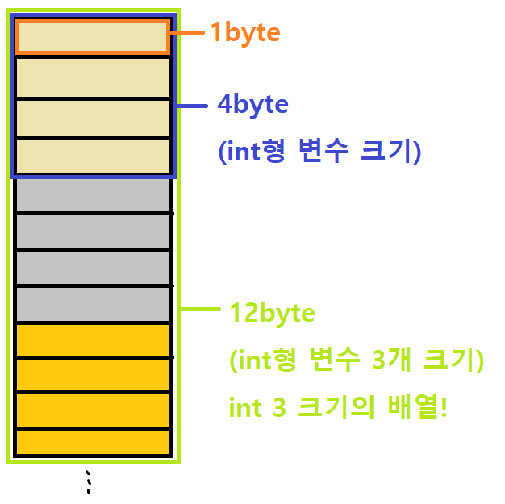
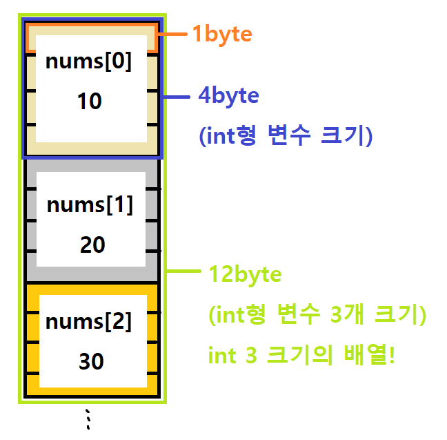
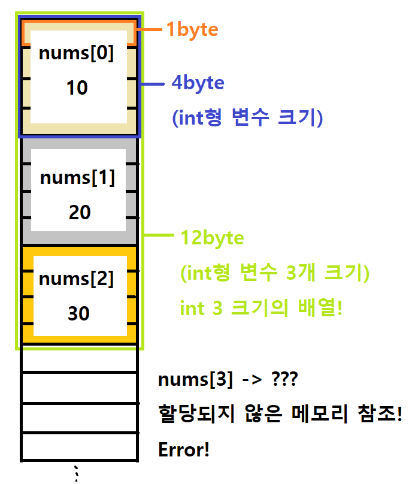
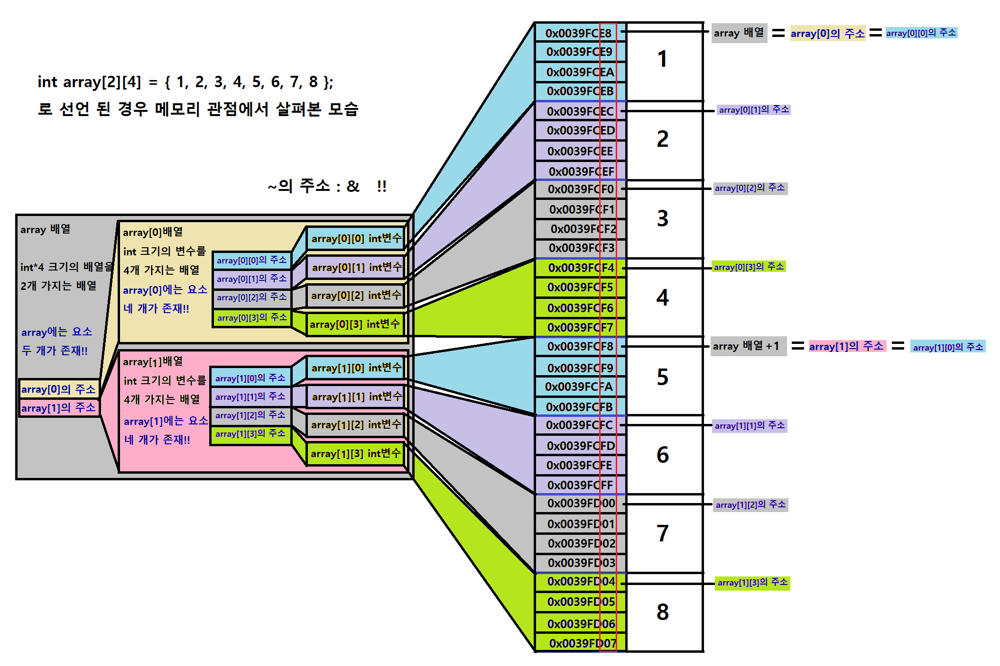

# Start

처음이라 어느 정도의 수준에 맞추어야 할지 파악하는 시간 필요할 듯!!

* 주요 개념 간단하게 짚고가기 (줄인다고 줄였는데 그래도 길다..)
  * 함수, 배열, 함수와 배열
* 해당 개념 응용 코딩문제 같이 풀어보기
* 개인적으로 질문 준 내용 설명하고 같이 공유하기


<hr/>

# 함수

Function. 특정한 '기능'을 수행

* 이미 정의된 함수 (라이브러리) 참조하여 사용
* 사용자가 직접 만들어 사용


### 프로토타입 (구성 요소)

* 함수의 **선언**

```c
int add(int x, int y);
```


* 함수의 **정의**

```c
int add(int x, int y) {

    return x + y;
}

반환타입 함수이름(매개변수, ...) {
    수행코드;
    [return 반환값;]
}
```


#### 반환타입

* 함수를 호출한 곳에 반환할 값의 타입
* 모든 자료형이 가능

```C
int sumOfOneAndTwo() {
    return 1+2;
    // 호출한 곳에다 반환. 그 값은, 코딩하는 사람이 결정
}

double averageOfScore() {
    return (99+97)/2
}

char returnRandomAlpha(){
    return rand()%26+65
}
// 반환 타입으로 모든 자료형이 될 수 있다. 구조체, 포인터도 마친가지..


int main() {
    int sum;
    
    if (sumOfOneAndTwo() == 3)
        printf("잘 수행되었음");
    
    sum = sumOfOneAndTwo();
	printf("%d", sum);
}


// 메인함수의 반환 타입
int main() {
    ...
	return 0;
}

void main() {
    ...
}


// printf 함수의 반환 타입
int printf(const char* format, ...); // 출력된 전체 문자의 개수를 반환한다.

void main() {
    int num;
    num = printf("");
}

// scanf ... 등등 만들어진 함수들 모두 '반환 타입'을 가지고 있다. 우리가 반환 값을 사용하지 않을 뿐.
```


#### 함수이름

* 그 함수의 기능이 잘 나타나도록 명명
* 표기법 - 스네이크 케이스, 파스칼 케이스, 카멜 케이스, 헝가리안 표기법 등..
  * function_of_this
  * FunctionOfThis
  * functionOfThis


#### 매개변수, 함수의 인자

* 매개 변수 : 전달된 인자를 받는 **변수**
  * 반환타입과 마찬가지로 모든 자료형이 가능
* 인자 : 전달된 **값** 자체

```C
int main() {
	int sum = addNumbers(10, 20); // 인자
    printf("%d\n", sum); // 30
    return 0;
}

int addNumbers(int num1, int num2) { // 임시변수, 매개변수 2개
    return num1 + num2; // 전달받은 두 수를 더해서 반환
}
```


#### 함수를 공부할 때 생각하며 볼 부분

* 어떤 기능을 수행하나?
* 매개변수는 무엇인가?
  * 변수 타입은 뭔지
  * 몇개가 있는지
* 반환값은 있는가?
  * 타입이 뭔지
* 어떤 원리인가?


<hr/>

# 배열

동일한 타입의 변수들의 집합


### 선언 구문

* 선언

```c
int arr[5];

자료형 배열이름[배열 크기];
```


* 선언과 동시에 초기화

```c
double values[3] = {99.8, 87.5, 100.0}; // 선언과 동시에 초기화
char str[10] = "string"; // 선언과 동시에 초기화
```


### 배열의 크기

[해당 자료형 크기 x 개수] 만큼의 크기가 할당

* char arr[10]은 1byte x 10
* int arr[10]은 4byte x 10
* double arr[10]은 8byte x 10


### 배열의 접근

배열 이름 뒤에 대괄호 사이 첨자(index)를 이용

```c
int nums[3] = {10, 20, 30};

nums[0] // 10
nums[1] // 20
nums[2] // 30
```

* 헷갈리지 않게 주의. Index는 0부터. [0] ~ [크기-1] 까지 접근 가능
* 유효 범위를 벗어나 참조하면 오류 발생


### 메모리적인 관점

* **%p**를 이용하면 해당 변수(메모리)의 **주소**가 출력된다.

```c
#include <stdio.h>

void main() {
	int nums[3];

	printf("%p\n", nums);
	printf("%p\n", &nums[0]);
	printf("%p\n", &nums[1]);
	printf("%p\n", &nums[2]);
}
```

* 주소 개념 중요!!! 포인터 부분에서 다시 언급
* **배열 이름은 배열의 첫 번째 주소이다.** 이 문장을 인지만 하고 넘어가자.




* 컴퓨터 메모리 어딘가에 변수들이 크기만큼 할당




* 메모리적인 관점에서 보면, **int nums[3] = {10, 20, 30}** 은 위와 같은 상태로 저장되어 있음
* 메모리의 개념으로도 이해하고 넘어가자!


#### 원소 접근 에러



* 위에서 유효 범위를 벗어나 참조하면 오류 발생! 라고 한 부분
* 크기 3만큼만 할당했기 때문에, 0~2까지.
* 읽기만 하는건 쓰레기값을 참조, 수정시 Error. 프로그램 멈춤


#### 간단한 응용

* 배열에 전공 점수를 입력받아 평균 구해 출력

```c
#define _CRT_SECURE_NO_WARNINGS
#include <stdio.h>

int main() {
	double score[3];
	double avg = 0.0;

	for (int i = 0; i < 3; i++) {
		scanf("%lf", &score[i]);
	}

	for (int i = 0; i < 3; i++) {
		avg += score[i];
	}

	avg /= 3;
	printf("세 점수의 평균은 %.2lf 입니다.\n", avg);
}
```


* 배열에 랜덤 숫자 10개 입력받아 출력

```c
#include <stdio.h>
#include <stdlib.h>
#define SIZE 10

int main() {
    int randNums[9];
    srand((unsigned)time(NULL));

    // randNums[] 0 ~ 9까지 random 숫자 대입
    for (int i = 0; i < 10; i++) {
        randNums[i] = rand() % 100 + 1;
    }

    // randNums[] 0 ~ 9까지 각각 출력
    for (int i = 0; i < 10; i++) {
        printf("%d", randNums[i]);
        if (i != 9)
            printf(", ");
    }

    return 0;
}
```


<hr/>

# 다차원 배열


#### 이차원 배열

2차원 좌표 평면을 생각하면 됨. 행과 열 구조로 대괄호 두 개 필요


#### 3차원 배열

x,y,z 축. 벡터를 생각하자. 사실 수학적 코딩 아닌 이상 잘 쓰이진 않아서
차원이 하나 늘어난 것 뿐이다. 2차원에서 [] 하나만 더 써서 생각하면 됨

int arr[][][]\[][]


### 선언 구문

* 선언

```c
int arr[2][4]; // 선언

자료형 배열이름[배열 행크기][배열 열크기]
```


* 선언과 동시에 초기화

```c
int arr2[2][4] = {{1,2,3,4}, {5,6,7,8}}; // 선언과 동시에 초기화
char str[4][10] = {"hello", "test", "string", "hi"}; // 선언과 동시에 초기화
```


### 배열의 크기

[해당 자료형 크기 x 행 개수 x 열 개수] 만큼의 크기가 할당

* char arr[2]\[10]은 1byte x 2 x 10
* int arr[2]\[10]은 4byte x 2 x 10
* double arr[2]\[10]은 8byte x 2 x 10


### 배열의 접근

배열 이름 뒤에 대괄호 사이 첨자(index)를 이용

```c
int nums[2][3] = {{1,2,3}, {10, 20, 30}};

nums[0][0] // 1
nums[0][1] // 2
nums[0][2] // 3
    
nums[1][0] // 10
nums[1][1] // 20
nums[1][2] // 30
```

* 마찬가지 Index는 0부터. [0] ~ [크기-1] 까지 접근 가능
* 유효 범위를 벗어나 참조하면 오류 발생


### 메모리적인 관점

* 포인터 때 다시 언급 예정
* 0x0039... 는 컴퓨터 메모리 어딘가의 '주소'
  * int array[2]\[4] = {{1,2,3,4}, {5,6,7,8}};




#### 간단한 응용

* 배열에 최고, 최저 온도를 입력하여 요일별 평균 온도를 구해 출력

```c
#define _CRT_SECURE_NO_WARNINGS
#include <stdio.h>

int main() {
    double temp[5][2] = {
        {21, 15},
        {28, 17},
        {27, 16},
        {26, 17},
        {28, 19}
    }
}
```


<hr/>

# 함수와 배열

함수에 배열을 넘기는 방법


```c
int function1(int a);
int sumOfNumbers(int arr[]);

배열을 함수의 매개변수로 설정할 수 있다.
    

void main() {
    int numbers[5] = {1,2,3,4,5};
    sumOfNumbers(numbers);
}

함수의 인자로 배열의 이름을 주어 넘길 수 있다.
    // 배열의 이름은 배열의 첫번째 주소 == 배열은 포인터
```


* 값이 들어있는 배열 arr의 값을 모두 더해 평균을 반환하는 함수

```c
#include <stdio.h>

double sumOfNumbers(int[], int);

void main() {
    int arr[3] = {99, 98, 100};
    
    printf("평균은 %lf\n", sumOfNumbers(arr, sizeof(arr)/sizeof(arr[0])));
    // 배열의 이름은, 배열의 첫 번째 주소  / 배열의 원소 개수 3을 넘겨줌
}

double sumOfNumbers(int arr[], int size) {
    int sum = 0;
    
    for (int i=0; i<size; i++) {
        sum += arr[i];
    }
    
    return sum/3;
}
```


* 이차원 배열을 함수로 넘길 수도 있다.

```c
int sumOfNumbers(int arr[2][10]);
```


처음이라 어느 정도의 수준에 맞추어야 할지 파악하는 시간 필요!!

* 주요 개념 간단하게 짚고가기 (줄인다고 줄였는데 그래도 길다..)
* 해당 개념 응용 코딩문제 같이 풀어보기
* 개인적으로 질문 준 내용 설명하고 같이 공유하기
* 본인이 코딩하며 어려웠던 문제 알려주면 같이 풀어보기

=> 시간이 길지 않다보니.. 어떤 방법이 가장 효율적이고 도움이 될지?

=> 개념은 기본적으로 각자 공부하고 온다는 가정하에 진행하는 것이 효율적일 것 같긴 함


함수

배열

다차원 배열

포인터

다중 포인터

문자열

구조체, 공용체, 열거형

파일 입출력

동적 메모리


<hr/>

### 함수와 배열 연습 문제!!


#### 연습문제 1

* 배열에 1부터 10까지의 숫자를 임의의 순서로 선언
* 배열을 넘겨 모든 요소를 출력하는 함수 printAllElements()를 구현하라
* 인자로 넘긴 배열에서 최댓값을 찾아 반환하는 함수 findMax()를 구현하라
* 인자로 넘긴 배열에서 최솟값을 찾아 반환하는 함수 findMin()를 구현하라
* 인자로 넘긴 배열을 오름차순으로 정렬하는 함수 sortByAscending()를 구현하라
* 인자로 넘긴 배열을 내림차순으로 정렬하는 함수 sortByDescending()를 구현하라

```c
// 예시 코드)
#include <stdio.h>

void printAllElements(int []);
int findMax(int[]);
int findMin(int[]);
void sortByAscending(int[]);
void sortByDescending(int[]);

void main() {
	int arr[10] = { 9,1,2,4,6,8,5,3,7,10 };

    ...
        
}
```


#### 실행 결과


<hr/>

#### 연습문제 2

* 일차원 배열에 1부터 10까지의 임의의 숫자들을 저장
* 사용자로부터 임의의 숫자를 입력받기
* 인자로 배열과 입력받은 숫자를 넘겨 해당 숫자가 몇 번 나왔는지 반환하는 getFrequency() 함수를 구현하라
* 인자로 넘긴 배열에서 각 숫자가 몇 번씩 나왔는지를 출력하는 printEachFrequency() 함수를 구현하라
* 인자로 넘긴 배열에서 가장 많은 빈도가 나온 숫자를 **모두** 출력하는 printMostFrequent() 함수를 구현하라

```c
// 예시 코드)
#include <stdio.h>

int getFrequency(int, int[]);
void printEachFrequency(int[]);
void printMostFrequent(int[]);

void main() {
	int ary[] = { 1,3,4,5,6,7,8,9,2,8,2,5,9,1,5,9,1,9,6,3,4,1,5,4,6,7,9,8,5,1,3,4,6 };

    ...

}
```


#### 실행 결과


<hr/>

#### 연습문제 3

* 인자로 넘긴 두 일차원 배열을 비교해 같다, 다르다를 출력하는 함수 compareArray() 를 구현하라
* 인자로 넘긴 두 이차원 배열을 비교해 같다, 다르다를 출력하는 함수 compareArray2() 를 구현하라

```c
// 예시 코드)
#include <stdio.h>
#define SIZE 4

____ compareArray(_______);
____ compareArray2(_______);

void main() {
    int aryA1[] = { 1,3,5,7,9 };
    int aryA2[] = { 1,3,5,7,9,10 };
    
    int aryB1[] = { 10,20,30,40 };
    int aryB2[] = { 10,20,30,40 };
    
    int aryC1[][SIZE] = { {10,30,20,40}, {1,3,2,4} };
    int aryC2[][SIZE] = { {10,30,20,40}, {1,3,2,4},{0} };
    
    ...

}
```


#### 실행 결과


<hr/>

#### 연습문제 4

* 2차원 배열 A, B를 선언
* 인자로 넘긴 두 이차원 배열에 대해 행렬의 덧셈 연산을 수행하는 addArray() 함수를 구현하라
* 인자로 넘긴 두 이차원 배열에 대해 행렬의 뺄셈 연산을 수행하는 subArray() 함수를 구현하라
* 인자로 넘긴 이차원 배열을 행에 따라 개행하여 출력하는 printArray() 함수를 구현하라

```c
// 예시 코드)
#include <stdio.h>
#define SIZE 4

void addArray(int A[][SIZE], int B[][SIZE], int result[][SIZE]);
void subArray(int A[][SIZE], int B[][SIZE], int result[][SIZE]);
void printArray(int result[][SIZE]);

int main() {
    int A[][SIZE] = {
        {1,3,5,6},
        {1,1,0,1},
        {2,4,1,3},
        {5,1,2,0}
    };
    int B[][SIZE] = {
        {1,1,1,1},
        {1,1,1,1},
        {0,0,0,0},
        {1,1,1,1}
	};
	int result[][SIZE] = {0};
    
    ...
        
}
```


#### 실행 결과


<hr>

#### 연습문제 5

* [4]\[4] 크기의 배열에 [3]\[3]의 숫자들을 저장
* 이 배열을 인자로 넘겨 가로 합, 세로 합을 각각 계산하여 넣는 함수 calArray()를 구현하라
  * 각 줄에 해당하는 값들을 모두 더해 그 줄의 마지막 열에 저장하고, 각 열에 해당하는 값들을 모두 더해 그 열의 마지막 행에 저장한다.
* 인자로 최종 결과 배열을 넘겨 개행하여 출력하는 printArray()를 구현하라

```c
1 2 3 _
2 3 4 _
1 0 1 _
_ _ _ _   이렇게 4x4 행렬에 3x3 값이 주어진 경우

가로 덧셈 1+2+3의 값을 _에 넣고, 2+3+4의 값을 _에 넣고, 1+0+1의 값을 _에 넣는다.
세로 덧셈 1+2+1의 값을 _에 넣고, 2+3+0의 값을 _에 넣고, 3+4+1의 값을 _에 넣는다.
마지막으로 각 더한 _의 값들을 모두 더해 우측 하단의 _에 저장한다.


// 예시 코드)
#include <stdio.h>
#define SIZE 4

void calArray(int[][SIZE], int);
void printArray(int[][SIZE], int);

int main() {
    int arr[SIZE][SIZE] = {
        {1,2,3},
        {2,3,4},
        {1,0,1}
    };
    
    ...
        
}
```


#### 실행 결과


<hr>


* 2차원 배열을 선언하여 매개변수로 넘겨 전치행렬을 만들어 저장해 출력하는 함수
* 2차원 배열 A, B를 선언하여 두 배열에 대해 행렬 곱셈연산을 수행하는 함수
* 평점(4.5 만점) grade 정보가 주어질 때, 평점을 점수(100 만점)로 환산한 배열 출력하는 함수
* 3차원 배열을 넘겨 1면, 2면으로 나누어 출력하는 함수
* 5개의 데이터를 입력한 배열을 매개변수로 넘겨주어, 모든 요소를 출력하는 함수 / max 찾는 함수
* (2, 4) 2차원 배열 8개의 값을 매개변수로 넘겨 포인터 형식 접근 / 2차원 배열 접근으로 Sum 반환 함수
* (5, 5) 배열에 (4, 4) 값이 주어질 때, 매개변수로 넘겨 가로 합, 세로 합을 구해 넣는 함수 / 출력하는 함수
* 전치행렬 만드는 함수
* 중간, 기말 점수가 2차원 배열로 주어질 때, 매개변수로 넘겨 합을 구하는 함수 / 각 평균, 전체 평균 출력


