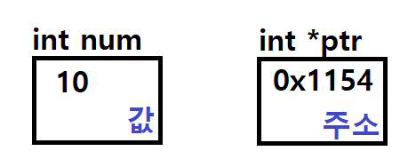

# Start

* 지난주 연습 문제 어려웠던 부분 같이 풀어보기


#### 지난주 연습문제

* 다음 코드들을 볼 때 가져야할 마음가짐 : 난 이렇게 풀었는데, 뭐.. 얘는 저렇게 풀었군.


* 1번

```c
#include <stdio.h>

void printAllElements(int[]);
int findMax(int[]);
int findMin(int[]);
void sortByAscending(int[]);
void sortByDescending(int[]);

void main() {
	int arr[10] = { 9,1,2,4,6,8,5,3,7,10 };

	printAllElements(arr);

	printf("최댓값 : %d\n", findMax(arr));
	printf("최솟값 : %d\n", findMin(arr));

	sortByAscending(arr);
	printAllElements(arr);

	sortByDescending(arr);
	printAllElements(arr);

}

void printAllElements(int arr[]) {
	for (int i = 0; i < 10; i++) {
		printf("%d", arr[i]);
		if (i != 9)
			printf(", ");
	}
	puts("");
}

int findMax(int arr[]) {
	int max = arr[0];

	for (int i = 1; i < 10; i++) {
		if (max < arr[i])
			max = arr[i];
	}
	return max;
}

int findMin(int arr[]) {
	int min = arr[0];

	for (int i = 1; i < 10; i++) {
		if (min > arr[i])
			min = arr[i];
	}
	return min;
}

void sortByAscending(int arr[]) {
	int temp;
	
	for (int i = 0; i < 10; i++) {
		int min_index = i;
		for (int j = i; j < 10; j++) {
			if (arr[min_index] > arr[j]) {
				min_index = j;
			}
		}
		temp = arr[i];
		arr[i] = arr[min_index];
		arr[min_index] = temp;
	}
}

void sortByDescending(int arr[]) {
	int temp;

	for (int i = 0; i < 10; i++) {
		int max_index = i;
		for (int j = i; j < 10; j++) {
			if (arr[max_index] < arr[j]) {
				max_index = j;
			}
		}
		temp = arr[i];
		arr[i] = arr[max_index];
		arr[max_index] = temp;
	}
}

```


* 2번

```c
#define _CRT_SECURE_NO_WARNINGS
#include <stdio.h>

int calFrequncy(int[], int[], int);
int getFrequency(int, int[]); // 미사용
int getMaxFrequency(int[], int);
void printEachFrequency(int[]);
void printMostFrequent(int[], int);

void main() {
	int arr[] = { 1,3,4,5,6,7,8,9,2,8,2,5,9,1,5,9,1,9,6,3,4,1,5,4,6,7,9,8,5,1,3,4,6 };
	int frequency[9] = {0};
	int num, max;
	int arr_size = sizeof(arr) / sizeof(arr[0]);
	int frequency_size = sizeof(frequency) / sizeof(frequency[0]);

	printf("1~9 사이의 임의의 숫자 입력 : ");
	scanf("%d", &num);

	calFrequncy(arr, frequency, arr_size);

	// getFrequency(num, frequency);
	printf("%d는 %d번 나왔습니다.\n\n", num, frequency[num - 1]);
	
	printEachFrequency(frequency);

	printMostFrequent(frequency, frequency_size);
}

int calFrequncy(int arr[], int frequency[], int size) {

	for (int i = 0; i < size; i++) {
		frequency[arr[i] - 1]++;
	}
}

int getFrequency(int num, int frequency[]) {
	
	// . . .

	return frequency[num - 1];
}

void printEachFrequency(int frequency[]) {
	for (int i = 0; i < 9; i++) {
		printf("%d : %d번   |  ", i + 1, frequency[i]);
		if ((i + 1) % 3 == 0)
			printf("\n");
	}
}

int getMaxFrequency(int frequency[], int size) {
	int max = frequency[0];

	for (int i = 0; i < 9; i++) {
		if (max < frequency[i]) {
			max = frequency[i];
		}
	}

	return max;
}

void printMostFrequent(int frequency[], int size) {
	int max = getMaxFrequency(frequency, size);

	printf("\n가장 많이 나온 숫자는 ");
	for (int i = 0; i < size; i++) {
		if (max == frequency[i])
			printf("%d, ", i + 1);
	}
	printf("\b\b가 %d번씩 나왔습니다.\n", max);
}
```


* 3번

```c
#include <stdio.h>
#define SIZE 4

void printArray(int*);
int  compareArray(int[], int[], int, int);
int  compareArray2(int[][SIZE], int[][SIZE], int, int);

void main() {
    int aryA1[] = { 1,3,5,7,9};
    int aryA2[] = { 1,3,5,7,9,10 };
    int aryB1[][SIZE] = { {10,30,20,40}, {1,3,2,4}};
    int aryB2[][SIZE] = { {10,30,20,40}, {1,3,2,4},{0} };

    int a1Size = sizeof(aryA1) / sizeof(aryA1[0]);
    int a2Size = sizeof(aryA2) / sizeof(aryA2[0]);
    int b1Size = sizeof(aryB1) / sizeof(aryB1[0][0]);
    int b2Size = sizeof(aryB2) / sizeof(aryB2[0][0]);

    if (compareArray(aryA1, aryA2, a1Size, a2Size))
        printf("같은 배열입니다.\n");
    else
        printf("다른 배열입니다.\n");
    
    printf("같은 배열입니다.\n");

    if (compareArray2(aryB1, aryB2, b1Size, b2Size))
        printf("같은 배열입니다.\n");
    else
        printf("다른 배열입니다.\n");
}

void printArray(int *arr) {
    while (*arr != NULL) {
        printf("%d ", *(arr++));
    }
    puts("");
}

int compareArray(int arr1[], int arr2[], int size1, int size2) {
    if (size1 != size2)
        return 0;

    for (int i = 0; i < size1; i++) {
        if (arr1[i] != arr2[i])
            return 0;
    }

    return 1;
}
int compareArray2(int arr1[][SIZE], int arr2[][SIZE], int size1, int size2) {
    if (size1 != size2)
        return 0;

    for (int i = 0; i < size1/SIZE; i++) {
        for (int j = 0; j < SIZE; j++) {
			if (arr1[i][j] != arr2[i][j])
				return 0;
        }
    }

    return 1;
}

```


* 4번

```c
#include <stdio.h>
#define SIZE 4

void addArray(int A[][SIZE], int B[][SIZE], int result[][SIZE], int);
void subArray(int A[][SIZE], int B[][SIZE], int result[][SIZE], int);
void printArray(int result[][SIZE], int);

int main() {
    int A[SIZE][SIZE] = {
        {1,3,5,6},
        {1,1,0,1},
        {2,4,1,3},
        {5,1,2,0}
    };
    int B[SIZE][SIZE] = {
        {1,1,1,1},
        {1,1,1,1},
        {0,0,0,0},
        {1,1,1,1}
    };
    int result[SIZE][SIZE] = { 0 };
    
    printf("A + B의 결과는\n");
    addArray(A, B, result, SIZE);
    printArray(result, SIZE);

    printf("A - B의 결과는\n");
    subArray(A, B, result, SIZE);
    printArray(result, SIZE);
}

void addArray(int A[][SIZE], int B[][SIZE], int result[][SIZE], int size) {
    for (int i = 0; i < size; i++) {
        for (int j = 0; j < size; j++) {
            result[i][j] = A[i][j] + B[i][j];
        }
    }
}

void subArray(int A[][SIZE], int B[][SIZE], int result[][SIZE], int size) {
    for (int i = 0; i < size; i++) {
        for (int j = 0; j < size; j++) {
            result[i][j] = A[i][j] - B[i][j];
        }
    }
}

void printArray(int result[][SIZE], int size) {
    for (int i = 0; i < size; i++) {
        for (int j = 0; j < size; j++) {
            printf("%3d", result[i][j]);
        }
        puts("");
    }
    puts("");
}
```


* 5번

```c
#include <stdio.h>
#define SIZE 4

void calArray(int[][SIZE], int);
void printArray(int[][SIZE], int);

int main() {
	int arr[SIZE][SIZE] = {
		{1,2,3},
		{2,3,4},
		{1,0,1}
	};

	calArray(arr, SIZE);
	printArray(arr, SIZE);
}

void calArray(int arr[][SIZE], int size) {
	for (int i = 0; i < size-1; i++) {
		for (int j = 0; j < size-1; j++) {
			arr[i][size - 1] += arr[i][j];
		}
	}

	for (int j = 0; j < size; j++) {
		for (int i = 0; i < size - 1; i++) {
			arr[size-1][j] += arr[i][j];
		}
	}

	for (int j = 0; j < size - 1; j++) {
		arr[size - 1][size - 1] += arr[size - 1][j];
	}

	
}
void printArray(int arr[][SIZE], int size) {
	for (int i = 0; i < size; i++) {
		for (int j = 0; j < size; j++) {
			printf("%3d", arr[i][j]);
		}
		puts("");
	}
}
```


* 주요 개념 간단하게 짚고가기
  * 포인터, 함수와 포인터, 배열과 포인터, 다차원 포인터
  * 해당 개념 응용 예제


* 질문 내용

  * 함수의 인자로 넘긴 배열은 sizeof() 를 이용해 크기 판별 불가
  * printf("\n"); == puts(""); // 개행
  * 2차원 배열 선언 시, size를 확실하게 모두 넣어주기
    * int result[size\][size] = {0};


<hr/>

# 포인터

Pointer. 가리키는 것!

* 주소를 담는 자료형
  * 컴퓨터는 '메모리' 개념으로 접근해야.
  * 메모리가 할당되면 '주소'로 접근한다.
* 포인터 == 주소
  * '변수 A의 포인터' 라는 문장 == '변수 A의 주소'
* 책갈피, 링크  [naver.com](8080:192.122.171.14)


### 선언 방법

* 하나의 '자료형'

```c
int num = 10;
int* ptr;
ptr = &num; // & : 앰퍼샌드. 주소.
```



* 10이라는 **값**을 담고있는 'int형' 변수 num
* 변수 num의 **주소** 0x1154를 담고있는 'int형 포인터' 변수 ptr


* 포인터 변수 ptr이 num을 가리킨다 라고 표현하기도

```c
printf("%d", num);	// 10
printf("%p", &num); // 0x1154
printf("%p", ptr);	// 0x1154
printf("%d", *ptr);	// 10
```

* 역참조 연산자


### 메모리 관점


### 포인터 변수의 크기

* 주소를 나타내는 크기에 따라 다르다.
* 컴파일러의 bit 방식 - 32bit / 64bit 에 따라서 달라진다.
* 윈도우에서는 32bit 형식으로 코딩하다 보니 4byte

  맥에서는 아마 8byte


#### 간단한 응용

* 역참조 연산자 '*', 주소 연산자 '&' 의 사용을 잘 이해하자
* 그려가면서 볼까요

```c
#define _CRT_SECURE_NO_WARNINGS
#include <stdio.h>

int main() {
    int count = 10;
    int age = 25;
    int* intPtr = &age;
    
    printf("count   : %d\n", count);
    printf("age     : %d\n", age);
    printf("*intPtr : %d\n", *intPtr);

    printf("&count  : %p\n", &count);
	printf("&age    : %p\n", &age);
    printf("intPtr  : %p\n", intPtr);
    
    ++(*intPtr);
	intPtr = &count;
    --count;

    printf("count   : %d\n", count);
    printf("age     : %d\n", age);
    printf("*intPtr : %d\n", *intPtr);
        
    printf("&count  : %p\n", &count);
	printf("&age    : %p\n", &age);
    printf("intPtr  : %p\n", intPtr);    
}
```


<hr/>

# 함수와 포인터

함수에서 포인터 활용


### Call by value? or Call by reference?

값에 의한 호출이냐, 주소(참조)에 의한 호출이냐


#### 값에 의한 호출 (Call by value)

```c
#include <stdio.h>

void changeValue(int n); // int형 매개변수

void main() {
	int num = 10;
	
	printf("%d", num); // 10
	changeValue(num);	
	printf("%d", num); // 20
}

void changeValue(int n) {
	n = 20;
} // 이 함수가 호출이 끝나면 n이라는 메모리는 사라짐
```


#### 주소에 의한 호출 (Call by reference)

```c
#include <stdio.h>

void changeValue(int* n); // int형 포인터 매개변수

void main() {
	int num = 10;
	// 0x1100
	printf("%d", num); // 10
	changeValue(&num);
	printf("%d", num); // 20
}

void changeValue(int* n) {
    *n = 20;
}
```


엄밀히 따져서 정확히 말하면, 함수를 호출할 때 인자로 주는 '값'을 '복사'해서 넘겨준다.

이 때 복사하는 '값'이 리터럴 값 자체이면 **값에 의한 호출**,

복사하는 '값'이 주소값이면 **주소에 의한 호출**이다.

주소를 넘겨주면, 해당 메모리에 직접 접근할 수 있는 것


#### 간단한 응용

```c
#include <stdio.h>

void swap(int*, int*);

void main() {
    int a = 10;
    int b = 20;
    int temp;
    
	printf("a:%d, b:%d\n",a,b); // 10, 20
    
    // a, b swap!
    temp = a;
    a = b;
    b = temp;
    
    // 함수로는?
    swap(&a, &b);
	printf("a:%d, b:%d\n",a,b); // 10, 20
}

void swap(int* n1, int* n2) {
	int temp;
    
    temp = *n1;
    *n1 = *n2;
    *n2 = temp;
}
```


int형 변수는 인자로 넘기면 리터럴로 '값에 의한 호출'

과제로 했던 문제들.. 배열은 함수 안에서 막 요소들 변경 하고 그대로 출력 가능했다. 어떻게??


<hr/>

# 배열과 포인터


### 배열의 이름은 배열의 첫 번째 주소이다!

* **배열은 상수 형태의 포인터이다 O**  /  **포인터는 배열이다 X**
  * '선언'시 메모리가 할당 되는 것은 배열
  * 포인터는 '주소'를 담을 변수 만큼만 할당

```c
#include <stdio.h>

void main() {
    int arr[10]; //40byte;
    int *ptr = &num; // 32bit 기준 4byte;
    ptr = &count // 가능
        
    arr = &num; // X
}
```


* 배열은 주소를 넘겨주는 Call by reference 방식

```c
#include <stdio.h>
#define SIZE 2

void swap(int arr[], int size);
void printArray(int arr[]);

void main() {
    int arr[] = {1,2};
    
    printArray(arr, SIZE);
    swap(arr);
	printArray(arr, SIZE);
}

void swap(int arr[]) {
    int temp = arr[0];
    arr[0] = arr[1];
    arr[1] = temp;
}

void printArray(int arr[], int size){
    for(int i=0; i<size; i++) {
	    printf("arr[%d] : %d\n", i, arr[i]);
    }    
}
```


#### 배열을 주소로 넘기게 된 사연

* 인자, 매개변수, 지역변수 개념
* 만약 배열의 call by value 였다면?
  * 메모리 낭비, 성능 등
* 함수에 인자로 넘겨 사용 시 강제 포인터 변환, call by reference
  * 효율적
  * sizeof 불가

```c
void showSize(int arr[]);
void showSize2(int* arr);

void main() {
    int arr[10];
   	printf sizeof(arr); // 40
    
    showSize(arr);
	showSize2(arr);
}

void showSize(int arr[], int size) {
    printf sizeof(arr); // 32bit 기준 4
}
void showSize2(int* arr) {
    printf sizeof(arr); // 32bit 기준 4
}


// sizeof(arr)/sizeof(arr[0]);
```


#### 간단한 응용

* 배열과 포인터의 접근 방법을 비교해보자

```c
#include <stdio.h>

void main() {
	int arr[3] = { 10,20,30 };
	int* ptr = arr;
	int anyVal;

	printf("arr\t: %p\n", arr);
	printf("&arr\t: %p\n\n", &arr);

	printf("arr[0]\t: %d\n", arr[0]);
	printf("arr[1]\t: %d\n", arr[1]);
	printf("arr[2]\t: %d\n\n", arr[2]);
	
	printf("&arr[0]\t: %p\n", &arr[0]);
	printf("&arr[1]\t: %p\n", &arr[1]);
	printf("&arr[2]\t: %p\n\n", &arr[2]);
	
	printf("ptr\t: %p\n", ptr);
	printf("&ptr\t: %p\n", &ptr);
	printf("&anyVal\t: %p\n\n", &anyVal);

	printf("*ptr\t: %d\n", *ptr);
	printf("*ptr+1\t: %d\n", (*ptr)+1);
	printf("*ptr+2\t: %d\n\n", (*ptr)+2);
	
	printf("*ptr\t: %d\n", *ptr);
	printf("*(ptr+1): %d\n", *(ptr+1));
	printf("*(ptr+2): %d\n\n", *(ptr+2));

	printf("ptr[0]\t: %d\n", ptr[0]);
	printf("ptr[1]\t: %d\n", ptr[1]);
	printf("ptr[2]\t: %d\n\n", ptr[2]);

	printf("&ptr[0]\t: %p\n", &ptr[0]);
	printf("&ptr[1]\t: %p\n", &ptr[1]);
	printf("&ptr[2]\t: %p\n\n\n", &ptr[2]);


    for (int i = 0; i < 3; i++) {
		printf("&arr[%d] : %p\tarr[%d] : %d\n", i, &arr[i], i, arr[i]);
	}

	for (int i = 0; i < 3; i++) {
		printf("&ptr[%d] : %p\tptr[%d] : %d\n", i, &ptr[i], i, ptr[i]);
	}
    
    for (int i = 0; i < 3; i++) {
		printf("arr+%d : %p\t*(arr+%d) : %d\n", i, arr+i, i, *(arr+i));
	}
    
    for (int i = 0; i < 3; i++) {
		printf("ptr+%d : %p\t*(ptr+%d) : %d\n", i, ptr+i, i, *(ptr+i));
	}
    
    // 포인터 접근 방식
}
```


<hr/>

# 다차원 포인터


#### 이차원 포인터

포인터의 포인터. 이중 포인터라고도 한다.

주소를 담는 변수인 **포인터 변수의 주소**를 담는 변수


#### 삼차원 포인터

포인터의 포인터의 포인터. 삼중 포인터라고도 한다.

사실상 삼중 포인터까지는 일반적으로 많이 쓰이지는 않음


### 이차원 포인터의 선언 및 이해

```c
int num = 10;
int *ptr = &num;
int **ptr2 = &ptr;
```


#### 메모리적인 관점


* ptr2 == &ptr
* *ptr2 == ptr == &num
* **ptr2 == *ptr == num == 10

그 주소값을 참조(*)하면 해당 메모리에는 또다시 다른 변수의 주소를 값으로 담고 있는 것!


#### 간단한 응용

```c
#include <stdio.h>

void main() {
	int num = 10;
	int* ptr = &num;
	int** ptr2 = &ptr;

	printf("%d == %d == %d \n", num, *ptr, **ptr2);
	printf("%p == %p == %p \n", &num, ptr, *ptr2);
	printf("%p == %p \n", &ptr, ptr2);

	*ptr = 20;
	printf("%d\n", num);

	**ptr2 = 30;
	printf("%d\n", num);
}
```


### 이차원 포인터와 배열

2차원 배열은 포인터 형식으로 표현할 수 있지만, 이중 포인터는 2차원 배열을 표현할 수 없다.


함수

배열

다차원 배열

포인터

다중 포인터

문자열

구조체, 공용체, 열거형

파일 입출력

동적 메모리
