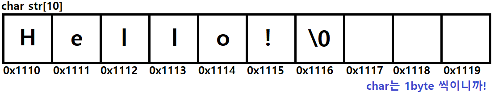
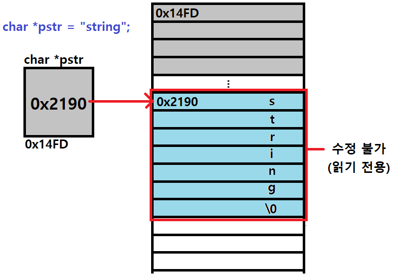

# Start

* 주요 개념 간단하게 짚고가기
  * 다차원 포인터, 문자열
  * 해당 개념 응용 예제


array\[][]

array : 0x0039FCE8

*array : array[0] == 0x0039FCE8

array+1 == 0x0039FCF8

array[1] == 0x0039FCF8

array[0\][0]+3 = 13

*(array[0]+2)) = 40

\*(*(array[1])+3) = 80

**array+1 == array[0\][0] + 1 == 11


### 다차원 포인터

#### 이차원 포인터

포인터의 포인터. 이중 포인터라고도 한다.

주소를 담는 변수인 **포인터 변수의 주소**를 담는 변수


#### 삼차원 포인터

포인터의 포인터의 포인터. 삼중 포인터라고도 한다.

사실상 삼중 포인터까지는 일반적으로 많이 쓰이지는 않음


#### 이차원 포인터의 선언 및 이해

```c
int num = 10;
int *ptr = &num;
int **ptr2 = &ptr;
```


#### 메모리적인 관점


* ptr2 == &ptr
* *ptr2 == ptr == &num
* **ptr2 == *ptr == num == 10

그 주소값을 참조(*)하면 해당 메모리에는 또다시 다른 변수의 주소를 값으로 담고 있는 것!


#### 간단한 응용

```c
#include <stdio.h>

void main() {
	int num = 10;
	int* ptr = &num;
	int** ptr2 = &ptr;

	printf("%d == %d == %d \n", num, *ptr, **ptr2);
	printf("%p == %p == %p \n", &num, ptr, *ptr2);
	printf("%p == %p \n", &ptr, ptr2);

	*ptr = 20;
	printf("%d\n", num);

	**ptr2 = 30;
	printf("%d\n", num);
}
```


### **포인터 배열**

* 배열의 요소로 '포인터', 즉 **주소 타입을 값으로 가지는 배열**
* char 형 배열 / int 형 배열 / double 형 배열
* **char\***형 배열 / **int\***형 배열 
* int *p[3]

```c
int a, b, c ,d, e;
int* arr[5] = {&a, &b, &c, &d, &e};
```

* 주로 문자열에서 많이 쓰이는 개념. 이후에 문자열에서 다시..


void 

### **배열 포인터**

* int arr[5];
* ....
* int (*p)[5] = {arr);
* **특정 크기 형식의 배열을 가리키는 포인터**
* **char형 ***, **int형 ***, **struct ***, ... **int [5]** 형 포인터!
* **배열의 이름은 배열의 첫 번째 주소**(를 가리키고 있다)
* **배열 포인터**는 **특정 크기의 배열**을 가리키고 있다
  * 배열을 가리키고 있는 포인터
  * 주소를 가리키고 있는 포인터 변수
  * 포인터의 포인터랑 비슷한 개념 같지만, 둘은 차이가 있다.
  * 배열은 포인터지만, 포인터는 배열이 아니다! 헷갈릴 수 있는 개념.
  * 이차원 배열은 배열 포인터로 받는 것이 올바른 방법이다.
* [참고](https://blockdmask.tistory.com/56)

```c
#include <stdio.h>
#define ROW 2
#define COL 3
void printArr(int(*arr)[COL]);
void printArrJustPointer(int* arr);

void main() {
	int twoArr[ROW][COL] = { {10,20,30}, {40,50,60} };
	int** doublePtr = twoArr; // 이중 포인터로 이차원 배열의 주소를 가리키는 것은 올바른 방법이 아니다.
	int (*ptrPtr)[COL] = twoArr; // 배열을 가리키는 포인터를 이용해 이차원 배열의 주소를 가리키는 것이 올바른 방법!
	// == &twoArr == twoArr[0] == &twoArr[0] == &twoArr[0][0]

	printf("twoArr \t\t= %p\n", twoArr);
	printf("&twoArr \t= %p\n", &twoArr);
	printf("twoArr[0] \t= %p\n", twoArr[0]);
	printf("&twoArr[0] \t= %p\n", &twoArr[0]);
	printf("&twoArr[0][0] \t= %p\n\n", &twoArr[0][0]);

	printf("&ptrPtr \t= %p\n", &ptrPtr);
	printf("ptrPtr\t\t= %p\n", ptrPtr);
	printf("ptrPtr[0] \t= %p\n", ptrPtr[0]);
	printf("&ptrPtr[0] \t= %p\n", &ptrPtr[0]);
	printf("*ptrPtr \t= %p\n", *ptrPtr);
	printf("ptrPtr[0][0] \t= %d\n", ptrPtr[0][0]);
	printf("**ptrPtr \t= %d\n", **ptrPtr);
	printf("&ptrPtr[0][0] \t= %p\n\n", &ptrPtr[0][0]);

	printf("&doublePtr \t= %p\n", &doublePtr);
	printf("doublePtr\t= %p\n", doublePtr);
	printf("doublePtr[0] \t= %d\n", doublePtr[0]);	// 잘못된 접근 (에러는 아님. 경고...)
	printf("&doublePtr[0] \t= %p\n", &doublePtr[0]);
	printf("*doublePtr \t= %d\n", *doublePtr);		// 잘못된 접근 (에러는 아님. 경고...)
	//printf("doublePtr[0][0] \t= %d\n", doublePtr[0][0]);	// 잘못된 접근 (프로그램 멈춤)
	//printf("*doublePtr \t= %d\n", **doublePtr);			// 잘못된 접근 (프로그램 멈춤)
	printf("&doublePtr[0][0]= %p\n\n", &doublePtr[0][0]);

	printArr(ptrPtr);
}

void printArr(int(*arr)[COL]) {
	for (int i = 0; i < ROW; i++) {
		for (int j = 0; j < COL; j++) {
			printf("%d ", arr[i][j]); // 일반적인 배열 접근 방식
		}
	}
	puts("");

	for (int i = 0; i < ROW; i++) {
		for (int j = 0; j < COL; j++) {
			printf("%d ", *(*(arr + i) + j)); // 포인터 접근 방식
		}
	}
	puts("");

	for (int i = 0; i < ROW; i++) {
		for (int j = 0; j < COL; j++) {
			printf("%d ", (*(arr + i))[j]); // 포인터 배열 접근 방식
		}
	}
	puts("");
}

void printArrJustPointer(int* arr) {
	for (int i = 0; i < ROW; i++) {
		for (int j = 0; j < COL; j++) {
			printf("%d ", *(arr + i * ROW + j)); // 일차원 포인터 접근 방식
		} // 어쨌거나 메모리는 일차원 연속적인 '선형'메모리 이므로.. 이 방식도 잘 이해하자
          // (개인적으로 이 방법 헷갈리지만 가장 선호ㅋ)
	}
	puts("");
}
```


### 이차원 배열과 포인터

* 2차원 배열은 포인터 형식으로 표현할 수 있지만, 이중 포인터는 2차원 배열을 표현할 수 없다!!
  * 위에 코드에서 보았듯이..


#### 연산자 우선 순위


#### 배열 포인터와 포인터 배열의 차이

```c
int *pa[];
pa = {&a, &b, &c}
```

* **포인터 배열**
  * **먼저 이건 배열**이다. 근데 요소로 '포인터'를 담고있는 것


```c
int arr[5];
int arr2[2]
int (*pa)[5] = arr2;
```

* **배열 포인터**
  * **먼저 이건 포인터**다. 근데 뭘 가리키느냐? '배열'을 가리키는 포인터 자료형인 것
  * 사실상 포인터 배열은 많이 쓰이는 문법은 아니지만, 정확한 이해가 필요하다.
  * 포인터 배열보다는 배열 포인터가 문자열에서 많이 사용되는 문법!


### **함수 포인터**

* 반환타입 (*함수이름)(매개변수)
* 개인적으로 공부해보세요! 개별 질문으로  ^_^
* [참고](https://blog.naver.com/tipsware/221286052738)


### **구조체 포인터**

* 이것도 구조체에서 나중에..
  * malloc


# 문자열

* C언어에서 '문자열'은 따로 String 자료형이 없다.
  * **char형 배열**을 의미하기도 하고
  * **문자열 상수**를 의미하기도 한다.

```c
char charStr[20] = "캐릭터배열";
char *constStr = "문자열상수"
char str[10] = "Hello!\0";
```


### 선언 및 초기화

``` c
// 선언과 동시에 초기화 하는 방법
char str[10] = "Hello!\0";
char *constStr = "문자열상수";

// 선언 후 초기화 하는 방법
char str[10];
// str = "Hello!"; // Error!
str[0] = 'H';
str[1] = 'e';
str[2] = 'l';
str[3] = 'l';
str[4] = 'o';
str[5] = '!';
str[6] = '\0'; // 반드시 널문자를 끝에 넣어줘야 한다!!!

char *constStr;  // const int num = 10;  num = 20 X
constStr = "문자열상수";
```

* char형 배열의 경우, 선언과 동시에 초기화 할 때만 "큰따옴표"를 이용해서 초기화
  * int형 마찬가지 { ... }
* 초기화 후엔 배열의 각 요소에 문자를 하나하나 대입해줘야 함


#### 메모리적 관점



* 문자열에서는, **널문자 '\0'**를 기준으로 문자열의 끝을 판별
  * 대입 연산자를 이용하거나 scanf 등의 format(%s)으로 초기화를 할 경우에는 알아서 들어가므로, **문자열의 크기를 설정할 때 고려해야**
  * 또, 인코딩 형식(ANSI, UTF-8, UTF-16...)에 따라 한글의 byte 수가 달라지므로 마찬가지로 **문자열의 크기를 설정할 때 고려해야 한다**.
    * 보통 UTF-8을 주로 쓰는데, 한글은 글자당 2byte이다.


#### NULL 값

* char 형에서 널값은 **'\0', '0' 둘다 NULL을 의미한다.**
* int 형에서 **0**은 NULL이 아닌 '값'이다. Zero.
* 포인터 형에서 NULL은 아무것도 가리키지 않는다.
  * char *ptr = **NULL**;


#### 간단한 응용

```c
#define _CRT_SECURE_NO_WARNINGS
#include <stdio.h>

void printAllChars(char*); // 문자 하나하나 출력해보기

void main() {
    // 선언 및 초기화 후 출력
    char str[20] = "Hello, String!\0";
    char* strPtr = NULL;
    strPtr = "Hello, String Pointer!";

    printf("%s\n", str);
    printf("%s\n", strPtr);
    
    // format %s로 입력받아 출력
    scanf("%s", str); // hello
    printf("%s\n", str); // hello\0

    // gets 함수로 입력받아 출력
    gets(str);
    puts(str);

    printAllChars(str);
}

void printAllChars(char* arr) {
    while (*arr != NULL) {
        printf("%c\n", *arr);
        arr++;
    }
}
```


### 배열 형식의 문자열 / 문자열 상수 형식의 문자열의 차이?

* "문자열 상수" 는 변경할 수 없는 상수, 저장된 시작 주소값 (읽기 전용. 포인터로 다룰 수 있음)
  * const int num = 10;	// 상수는 한번 선언하면 변경할 수 없다!

```c
char *pstr = "string";

printf("%c", pstr[0]); // 출력은 가능
pstr[0] = 'c' // 수정은 불가. 에러!
```

* Read_Only_Memory로 운영체제가 알아서 적당한 위치에 할당한다.
* 따라서 문자열 상수의 값은 **수정이 불가**!!



```c
char *pstr = "string";
pstr = "test";
```

* 위와 같은 상황의 경우, 상수의 값이 수정되는 것이 아니라, 아예 새로운 "string2"라는 상수를 메모리에 할당해서 그 주소를 바꿔 넣는 것.


```c
char str[10] = "string";
char *pstr = "string2";

str[0] = 'k';
puts(str); // "ktring";

pstr[0] = 'k'; // Error!
```

* 따라서 배열의 경우엔 요소 수정이 가능하지만, 문자열 상수의 경우엔 요소 수정이 불가능하다.
  * '허용되지 않는 접근'이라고 에러가 뜰 것. 전에 Array out of range 처럼.. 
* 다만 접근하여 '읽는' 것은 둘 다 가능하다.


#### 1. 선언과 동시에 초기화가 되느냐??

```c
char str[15] = "캐릭터 배열";		// 가능!
char *pstr = "문자열 상수";			// 가능!
```


#### 2. 선언 이후에 초기화가 되느냐??

```c
// char형 배열
char str[10] = "캐릭터 배열";
str = "수정된 배열";				// 불가!
str[0] = 's';					// 요소 하나하나 초기화 해야 함

// 문자열 상수
char *pstr = "문자열 상수";
pstr = "String_Const";			// 가능!
```


#### 3. 선언 이후에 수정이 되느냐??

```c
// char형 배열
char str[10] = "charactor";
printf("%c", str[0])		// 접근도 가능!
str[0] = 'k';				// 수정도 가능!

/*  결과 : "kharactor"  */


// 문자열 상수
char *pstr = "stringConst";
printf("%c", pstr[0])		// 접근은 가능!
pstr[0] = 'x'  				// 수정은 불가!

/*  결과 : "error" */
```


#### 4. 문자열을 입력해서 넣을 수 있느냐?

```c
// char형 배열
char str[10];		// 선언과 동시에 메모리 10byte만큼 할당 (길이 10) \0 포함!
scanf("%s", str)    // 길이 10까지 입력 가능 (\0 문자포함)		가능!
```

```c
// 문자열 상수
char *pstr = NULL; 		// 선언 시, char형 포인터 크기 4byte만큼 할당 (주소 대입 가능)
scanf("%s", pstr);  	// 가리키는 주소가 없습니다!				불가!

/*
=>  나중에 배울 malloc 동적 메모리 할당을 통해 해결 가능!
	pstr = (char*) malloc (sizeof(char) * 10); // 반환된다.
	heap 메모리에 char형*10 크기의 메모리가 할당되고, 그 첫번째 주소가 pstr에 대입된다.
	
	scanf("%s", pstr);
*/
```


함수

배열

다차원 배열

포인터

다중 포인터

문자열

구조체, 공용체, 열거형

파일 입출력

동적 메모리


## 다차원 포인터 연습 문제

#### 연습문제1

앞선 이차원 배열 문제를 포인터 방식으로 넘겨받는 코드로 수정하여라

* 2차원 배열 A, B를 선언
* 인자로 넘긴 두 이차원 배열에 대해 행렬의 덧셈 연산을 수행하는 add_arrPointer() 함수를 구현하라
* 인자로 넘긴 두 이차원 배열에 대해 행렬의 뺄셈 연산을 수행하는 sub_arrPointer() 함수를 구현하라
* 인자로 넘긴 이차원 배열을 행에 따라 개행하여 출력하는 print_arrPointer() 함수를 구현하라
  * 이 때, 이차원 배열을 넘겨 받는 **매개변수 형식은 일차원 포인터 또는 배열 포인터로 받는다.**
  * 함수에서 접근 방식은 **포인터 접근 방식**으로 한다.

```c
// 예시 코드)
#include <stdio.h>
#define SIZE 4

void add_arrPointer(int *A, int *B, int *result, int size);
void sub_arrPointer(int (*A)[SIZE], int (*B)[SIZE], int (*result)[SIZE], int size);
void print_arrPointer(int *result, int SIZE); // or int (*result)[SIZE]

int main() {
    int A[SIZE][SIZE] = {
        {1,3,5,6},
        {1,1,0,1},
        {2,4,1,3},
        {5,1,2,0}
    };
    int B[SIZE][SIZE] = {
        {1,1,1,1},
        {1,1,1,1},
        {0,0,0,0},
        {1,1,1,1}
	};
	int result[SIZE][SIZE] = {0};
    
    ...
        
}
```


#### 실행 결과


#### 연습문제 2

* [4]\[4] 크기의 배열에 [3]\[3]의 숫자들을 저장
* 이 배열을 인자로 넘겨 가로 합, 세로 합을 각각 계산하여 넣는 함수 cal_arrPointer()를 구현하라
  * 각 줄에 해당하는 값들을 모두 더해 그 줄의 마지막 열에 저장하고, 각 열에 해당하는 값들을 모두 더해 그 열의 마지막 행에 저장한다.
* 인자로 최종 결과 배열을 넘겨 개행하여 출력하는 print_arrPointer()를 구현하라
  * 이 때, 이차원 배열을 넘겨 받는 **매개변수 형식은 일차원 포인터 또는 배열 포인터로 받는다.**
  * 함수에서 접근 방식은 **포인터 접근 방식**으로 한다.

```c
1 2 3 _
2 3 4 _
1 0 1 _
_ _ _ _   이렇게 4x4 행렬에 3x3 값이 주어진 경우

가로 덧셈 1+2+3의 값을 _에 넣고, 2+3+4의 값을 _에 넣고, 1+0+1의 값을 _에 넣는다.
세로 덧셈 1+2+1의 값을 _에 넣고, 2+3+0의 값을 _에 넣고, 3+4+1의 값을 _에 넣는다.
마지막으로 각 더한 _의 값들을 모두 더해 우측 하단의 _에 저장한다.


// 예시 코드)
#include <stdio.h>
#define SIZE 4

void cal_arrPointer(int (*arr)[SIZE], int size);
void print_arrPointer(int *arr, int size);

int main() {
    int arr[SIZE][SIZE] = {
        {1,2,3},
        {2,3,4},
        {1,0,1}
    };
    
    ...
        
}
```


#### 실행 결과


