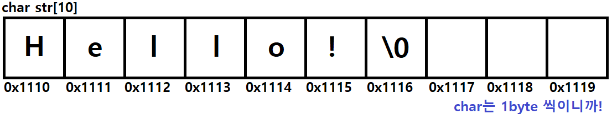
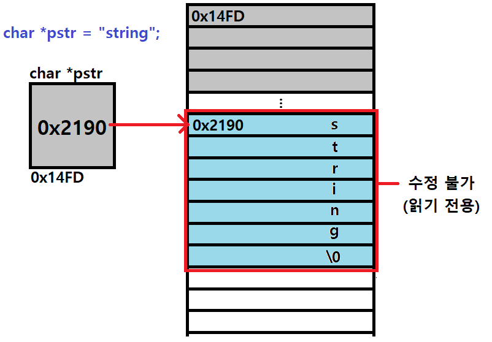

# Start


#### Mid.term 코딩문제

* 계산기

  ```c
  
  ```

* 랜덤 숫자 빈도 Max 찾기

  ```c
  #include <stdio.h>
  #include <stdlib.h>
  #include <time.h>
  
  int max_frequency(int[], int);
  int main(void)
  {
  	srand((unsigned)time(NULL));
  
  	int number[30];
  	int count = 0;
  	int size = sizeof(number) / sizeof(number[0]);
  
  	for (int i = 0; i < 30; i++)
  	{
  		number[i] = rand() % 10;
  	}
  
  	for (int i = 0; i < 30; i++)
  	{
  		printf("%d  ", number[i]);
  		count += 1;
  		if (count % 10 == 0)
  			puts("");
  	}
  
  	max_frequency(number, size);
  
  	return 0;
  }
  
  int max_frequency(int number[], int size)
  {
  	int n = 0;
  	int count = 0;
  	int freq[10] = { 0 };
  	int max = 0;
  
  	for (int i = 0; i < size; i++) {
  		freq[number[i]]++; // 짧은 코딩!
  	}
  
  //	freq 에서 max값을 찾으면!!
  
  	puts("");
  	printf("값 %d가 %d번으로 가장 많이 존재합니다.", n, max);
  }
  ```

* 특정 구간 구구단 풀기

  ```c
  
  ```

* 행렬의 곱셈

  ```c
  #include <stdio.h>
  #define ROW 3
  #define COL 3
  void mult_arr(int A[ROW][COL], int B[ROW][COL], int result[ROW][COL]);
  void prt_arr(int result[ROW][COL]);
  
  void main() {
  	int A[ROW][COL] = { {3,5,2},{4,2,7},{5,7,2} };
  	int B[ROW][COL] = { {1,0,0},{0,1,0},{0,0,1} };
  	int result[ROW][COL] = { 0 };
  
  	prt_arr(A);
  	puts("");
  	prt_arr(B);
  	puts("");
  	mult_arr(A, B, result);
  	prt_arr(result);
  }
  
  void mult_arr(int A[ROW][COL], int B[ROW][COL], int result[ROW][COL]) {
  	int i, j, k;
  
  	for (int i = 0; i < ROW; i++) {
  		for (int j = 0; j < COL; j++) {
  			for (int k = 0; k < COL; k++) {
  				result[i][k] += A[i][j] * B[j][k];
  			}
  		}
  	}
  }
  
  void prt_arr(int result[ROW][COL]) {
  	for (int i = 0; i < ROW; i++) {
  		for (int j = 0; j < COL; j++) {
  			printf("%3d", result[i][j]);
  		}
  		puts("");
  	}
  }
  ```


#### Tip

* 예외처리 (C에는 이 문법이 없음)

  * divide by zero
  * try catch
    * if문으로 ~이면 ~해라

* 함수의 반환형

  * void, int, ... 습관!

* 포인터 접근

  ```c
  #include <stdio.h>
  #define SIZE 6
  
  // 배열을 이용하지 않고 역순 출력
  int main(void) {
  	int a[SIZE] = { 11, 22, 33, 44, 55, 66 };
  	int* p = &a[0];
  	int* q = &a[5];
  
  	// p : 16진수 주소 형식을 담는 변수
  
  	/*
  	//for (int i = 0; i < SIZE; i++) {
  	for (int i = SIZE-1; i >= 0; i--) {
  		printf("*p+i : %d\t*(p+i) : %d\n", *p+i, *(p+i)); // 주소 접근
  	} // p가 &a[0]를 for문이 끝날때까지 계속 가리키고 있음.
  	//printf("p : %p\n", p);
  
  	p = &a[5];
  	for (int i = 0; i < SIZE; i++) {
  //		printf("p : %p\n", p);
  		printf("%d\n", *(p--)); // 주소 접근 2  다만 차이점은...
  	} // p가 &a[0]에서 하나씩 증가하면서 가리키고 있음.
  	printf("p : %p\n", p);
  	*/
  
  	while (p != q) {
  		printf("%d ", *(q--));
  	}
  	printf("%d ", *q);
  
  	return 0;
  }
  ```

  


# 문자열

* C언어에서 '문자열'은 따로 String 자료형이 없다.
  * **char형 배열**을 의미하기도 하고
  * **문자열 상수**를 의미하기도 한다.

```c
char charStr[20] = "캐릭터배열";
char *constStr = "문자열상수"
char str[10] = "Hello!\0";
```


### 선언 및 초기화

``` c
// 선언과 동시에 초기화 하는 방법
char str[10] = "Hello!\0";
char *constStr = "문자열상수";

// 선언 후 초기화 하는 방법
char str[10];
// str = "Hello!"; // Error!
str[0] = 'H';
str[1] = 'e';
str[2] = 'l';
str[3] = 'l';
str[4] = 'o';
str[5] = '!';
str[6] = '\0'; // 반드시 널문자를 끝에 넣어줘야 한다!!!

char *constStr;  // const int num = 10;  num = 20 X
constStr = "문자열상수";
```

* char형 배열의 경우, 선언과 동시에 초기화 할 때만 "큰따옴표"를 이용해서 초기화
  * int형 마찬가지 { ... }
* 초기화 후엔 배열의 각 요소에 문자를 하나하나 대입해줘야 함


#### 메모리적 관점



* 문자열에서는, **널문자 '\0'**를 기준으로 문자열의 끝을 판별
  * 대입 연산자를 이용하거나 scanf 등의 format(%s)으로 초기화를 할 경우에는 알아서 들어가므로, **문자열의 크기를 설정할 때 고려해야**
  * 또, 인코딩 형식(ANSI, UTF-8, UTF-16...)에 따라 한글의 byte 수가 달라지므로 마찬가지로 **문자열의 크기를 설정할 때 고려해야 한다**.
    * 보통 UTF-8을 주로 쓰는데, 한글은 글자당 2byte이다.


#### NULL 값

* char 형에서 널값은 **'\0', '0' 둘다 NULL을 의미한다.**
* int 형에서 **0**은 NULL이 아닌 '값'이다. Zero.
* 포인터 형에서 NULL은 아무것도 가리키지 않는다.
  * char *ptr = **NULL**;


### 배열 형식의 문자열 / 문자열 상수 형식의 문자열의 차이?

* "문자열 상수" 는 **변경할 수 없는 상수**, 저장된 시작 주소값 (읽기 전용. 포인터로 다룰 수 있음)
  * const int num = 10;	// 상수는 한번 선언하면 변경할 수 없다!

```c
char *pstr = "string";

printf("%c", pstr[0]); // 출력은 가능
pstr[0] = 'c' // 수정은 불가. 에러!
```

* Read_Only_Memory로 운영체제가 알아서 적당한 위치에 할당한다.
* 따라서 문자열 상수의 값은 **수정이 불가**!!



```c
char *pstr = "string";
pstr = "test";
```

* 위와 같은 상황의 경우, 상수의 값이 수정되는 것이 아니라, 아예 새로운 "string2"라는 상수를 메모리에 할당해서 그 주소를 바꿔 넣는 것.


```c
char str[10] = "string";
char *pstr = "string2";

str[0] = 'k';
puts(str); // "ktring";

pstr[0] = 'k'; // Error!
```

* 따라서 배열의 경우엔 요소 수정이 가능하지만, 문자열 상수의 경우엔 요소 수정이 불가능하다.
  * '허용되지 않는 접근'이라고 에러가 뜰 것. 전에 Array out of range 처럼.. 
* 다만 접근하여 '읽는' 것은 둘 다 가능하다.


#### 1. 선언과 동시에 초기화가 되느냐??

```c
char str[15] = "캐릭터 배열";		// 가능!
char *pstr = "문자열 상수";			// 가능!
```


#### 2. 선언 이후에 초기화가 되느냐??

```c
// char형 배열
char str[10] = "캐릭터 배열";
str = "수정된 배열";				// 불가!
str[0] = 's';					// 요소 하나하나 초기화 해야 함

// 문자열 상수
char *pstr = "문자열 상수";
pstr = "String_Const";			// 가능!
```


#### 3. 선언 이후에 수정이 되느냐??

```c
// char형 배열
char str[10] = "charactor";
printf("%c", str[0])		// 접근도 가능!
str[0] = 'k';				// 수정도 가능!

/*  결과 : "kharactor"  */


// 문자열 상수
char *pstr = "stringConst";
printf("%c", pstr[0])		// 접근은 가능!
pstr[0] = 'x'  				// 수정은 불가!

/*  결과 : "error" */
```


#### 4. 문자열을 입력해서 넣을 수 있느냐?

```c
// char형 배열
char str[10];		// 선언과 동시에 메모리 10byte만큼 할당 (길이 10) \0 포함!
scanf("%s", str)    // 길이 10까지 입력 가능 (\0 문자포함)		가능!
```

```c
// 문자열 상수
char *pstr = NULL; 		// 선언 시, char형 포인터 크기 4byte만큼 할당 (주소 대입 가능)
scanf("%s", pstr);  	// 가리키는 주소가 없습니다!				불가!

/*
=>  나중에 배울 malloc 동적 메모리 할당을 통해 해결 가능!
	pstr = (char*) malloc (sizeof(char) * 10); // 반환된다.
	heap 메모리에 char형*10 크기의 메모리가 할당되고, 그 첫번째 주소가 pstr에 대입된다.
	
	scanf("%s", pstr);
*/
```


------------------------------------------------------------------------------------------------------------------------------------------------


## 문자열 함수

* **<string.h> 헤더파일**에 미리 정의된 문자열 관련 함수가 많이 존재한다.
  * int strlen(char*) : 문자열 길이를 구해 반환하는 함수
  * void strcpy(char\*, char*) : 문자열을 복사하는 함수
  * void strcat(char\*, char*) : 문자열을 이어 붙이는 함수
  * int strcmp(char\*, char*) : 문자열이 같은지 비교하는 함수
  * char* strstr(char\*, const char*) : 문자열 속에 문자열이 존재하는지 찾는 함수
  * char* strtok(char\*, const char*) : 문자열을 token으로 분리하는 함수
* [등등..](https://modoocode.com/76)


* 그 외 유용한...

* **<stdlib.h> 헤더파일**

  * int atoi(const char *nptr) : 문자열을 int형 정수로 변환하는 함수
    * int(input())

* **<ctype.h> 헤더파일**

  * int toupper(int c) : 문자열의 모든 영문자를 대문자로 변환하는 함수

    int tolower(int c) : 문자열의 모든 영문자를 소문자로 변환하는 함수


#### 어떤 원리로 함수가 동작하는지 포인트를 이해하는 것이 중요!!


### strlen()

* ```c
  int strlen(char*)
  ```

  * '넘겨준 배열의 크기'를 구하는 것이 아니라, **배열에 몇개의 문자가 있는지** 문자열의 길이를 반환하는 함수
  * **'\0' 널문자를 기준으로 문자열의 끝을 판단**한다.
  * 반환 타입 int형, 매개변수 char*형 (주소)

```c
#include <stdio.h>
#include <string.h>

void main() {
    char* str1 = "hello"; // 6. 마지막에 \0
    char str2[10] = "hello";
    int len;

    len = strlen(str1); // &str1[0]
    puts(str1);
    printf("str1의 길이 : %d\n", len);

    len = strlen(str2);
    puts(str2);
    printf("str2의 길이 : %d\n", len);

    str2[2] = '\0';

    len = strlen(str2);
    puts(str2);
    printf("\\0을 추가한 str2의 길이 : %d\n", len);
}
```


### strcpy()

* ```c
  void strcpy(char* result, char* source)
  ```

  * source의 문자열을 result에 **복사**하는 함수
  * 이 함수 역시 **'\0'를 기준으로 문자열의 끝을 판단**
  * 반환값은 없다. call by reference!

* 주의할 점, 메모리의 크기를 반드시 고려해주어야 한다!

```c
#define _CRT_SECURE_NO_WARNINGS
#include <stdio.h>
#include <string.h>

void main() {
	char result[20] = "Hello";
	char source[10] = "my friend";

	printf("%s\n", result);
	strcpy(result, source);
	printf("%s\n", result); 
}
```


### strcat()

* ```c
  void strcat(char* result, char* source)
  ```

  * source의 문자열을 result 문자열 끝에 **이어 붙이는** 함수
  * 이 함수 역시 **'\0'를 기준으로 문자열의 끝을 판단**
  * 반환값은 없다. call by reference!

* 주의할 점, 메모리의 크기를 반드시 고려해주어야 한다!

```c
#define _CRT_SECURE_NO_WARNINGS
#include <stdio.h>
#include <string.h>

void main() {
	char result[20] = "Hello";
	char initialized[20] = "";
	char notInitialized[20];
	char source[10] = "my friend";

	strcat(result, source);
	printf("%s\n", result);
	
	strcat(initialized, source);
	printf("%s\n", initialized);

	strcat(notInitialized, source);
	printf("%s\n", notInitialized);
}

//	printf("%p", notInitialized); 주소 찍어보기 추가 정리
```


### strcmp()

* ```c
  int strcmp(char* str1, char* str2)
  ```

  * 두 문자열의 각 문자 아스키코드 값을 순차적으로 비교하여 **같은 문자열인지 비교**하는 함수
  * 반환 타입 int형, 매개변수 char*형 (주소)
    * -1 : ASCII 코드 기준으로 문자열2(str2)가 더 클 때
    * 0 : ASCII 코드 기준으로 두 문자열이 같을 때
    * 1 : ASCII 코드 기준으로 문자열1(str1)이 클 때
  * hallo, hello 비교
    * h를 먼저 비교한다.  → 같다!
    * 다음 a와 e를 비교한다. → 아스키코드로 하면 e가 더 크다!
    * 뒤에 있는 hello가 더 크므로 -1을 반환

```c
#include <stdio.h>
#include <string.h>

void main() {
	char str1[10] = "Hello"; // Hello
	char* str2 = "Hello";
	int result;
    
	result = strcmp(str1, str2);
	if (result == 0) {
        printf("%s와 %s는 같다.\n", str1, str2);
    } else {
        printf("%s와 %s는 다르다.\n", str1, str2);
    }
}
```


### int strstr()

* ```c
  char* strstr(char* str, const char* findStr);
  ```

  * str에서 findStr를 검색해 가장 먼저 나타나는 곳의 주소를 반환하는 함수
    * 일치하는 문자열이 없다면 NULL을 반환한다.

```c
#define _CRT_SECURE_NO_WARNINGS
#include <stdio.h>
#include <string.h>

void main() {
    char str[30] = "string study, this is strstr";
    char* findStr = "str";
    char* ptr = strstr(str, findStr);

    while (ptr != NULL) {
        puts(ptr);
        strcpy(str, ptr + strlen(findStr));
        ptr = strstr(str, findStr);
    }
}
```

* [보이어-무어 알고리즘](https://chanhuiseok.github.io/posts/algo-15/)


### void strtok()

* ```c
  char* strtok(char* str, const char* delimiters);
  ```

  * str에서 delimiters에 해당하는 구분자로 분리해 반환하는 함수
    * delimiters는 찾으려는 '문자열'이 아닌, 각각의 문자를 분리할 기준 토큰으로 친다.
  * 처음 호출 시 분리할 문자열과 기준 토큰을 주어 호출하고, **NULL을 반환할 때 까지 반복 호출하는 방식으로** 사용한다.
  * 앞에서부터 순차적으로 구분자에 해당하는 문자를 찾아, **'\0'문자로 바꾼 후** 처음 주소를 반환한다.
    * '\0' 문자를 기준으로 문자열을 구분하기 때문에, 토큰에 해당하는 문자 이전까지가 분리된 효과
  * **이후 호출 시 NULL과 기준 토큰을 주어 호출한다.**
    * '이전에 구분자를 찾았던 주소에서부터 찾으라'는 의미

```c
#define _CRT_SECURE_NO_WARNINGS
#include<stdio.h>
#include<string.h>

void main(void) {
	char str[] = "Today's_Menu\n Rice,Soup,Kimchi,Frieggs+Tomatosource";
	char* ptr = strtok(str, " ,+"); // 공백, 쉼표, +기호 를 분리할 토큰으로 한다

	while (ptr != NULL) {
		puts(ptr);
		ptr = strtok(NULL, ",+");
	}
}
```


### atoi()

```c
char str1[] = "1234"; // 문자 하나하나를 아스키코드로 인식해서 변환해서 더하는...
char str2[] = "20"; // '1' 문자의 아스키코드 50 -49 1 *1000 + 2*100 + 3*10 + 4

printf("문자열을 숫자로 변환해서 더한 값은 %d입니다.\n", atoi(str1) + atoi(str2));
```


### toupper(), tolower()

* toupper() : 매개변수로 받은 '문자'를 소문자면 대문자로 변환해주는 함수
* tolower() : 매개변수로 받은 '문자'를 대문자면 소문자로 변환해주는 함수
* 아스키코드를 이용한 함수!!

```c
#include <stdio.h>
#include <string.h>
#include <ctype.h>

void main() {
    char str[] = "Hello C World!";
    char* s = str;
    int len;

    printf("원래 문자열 : %s\n", str);
    len = strlen(str);
    /*
    for (int i = 0; i < len; i++) {
        str[i] = toupper(str[i]);
        // tolower(str[i]);
    }
    */

    while (*s != EOF) { // *(str++) : Error!
        // str은 배열의 첫 번째 주소를 가리키는 상수 포인터이기 때문에 값을 수정할 수 없다!!
        *(s++) = toupper(*s);
        // tolower(str[i]);
    }
 
    printf("바뀐 문자열 : %s\n", str);
}
```


## 문자열 연습 문제


#### 연습문제 1

my_puts() 함수 직접 구현해보기

* printf("%c") 를 이용해서 하나하나 출력하게


#### 연습문제 2

my_strlen() 함수 직접 구현해보기

문자의 개수 구하기


#### 연습문제 3

my_strcat() 함수 직접 구현해보기

이어붙이기


#### 연습문제 4

my_strcmp() 함수 직접 구현해보기

비교하기


#### 연습문제 5

my_atoi() 함수 직접 구현해보기

alpha to int (문자열을 int로)


#### 연습문제 6

toupper(), tolower() 함수 직접 구현해보기


#### Challenge 문제1

my_strtok() 함수 직접 구현해보기


#### Challenge 문제2

my_strstr() 함수를 보이어-무어 알고리즘으로 구현해보기


구조체!!!!!!!!!!!!!!!!!!!!!!!!

문자열!!!!!!!!!!!!!!!!!!!!!!!!
