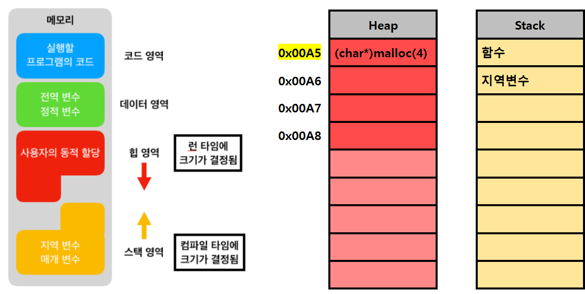

# Start


복습


## 파일 입출력

### 입출력에 대한 개념

* 기본 입력 stdin - 키보드 / 마우스 입력 0
* 기본 출력 stdout - 모니터 (콘솔) 출력 1
  * // 2 표준 에러

* 매핑된 정수 형태인 파일 디스크립터를 기준으로 운영체제는 입력 방향 / 출력 방향을 결정한다.
  * [출력 방향 개념](https://asthtls.tistory.com/51)


### 파일 입출력이란?

* 파일로부터 입력 받거나 출력하는 방법 (파일을 읽어오거나, 저장하는 방법)
* '문자열'을 기준으로 한다.
* 고수준 함수


### 과정

* 파일 처리를 위해서는 기본적으로 세 가지 단계가 존재
  * 파일 열기 (f**open**)
  * 파일 작업 읽고 쓰기 등
  * 파일 닫기 (f**close**)
  
  

#### **+ 파일 포인터??**

정확히는 파일 구조체의 포인터 FILE*
**C에서 정의된 stdio.h의 FILE 구조체 내용**

```c
typedef struct _iobuf {
	char* _ptr;		// 파일의 현재 위치(경로)  /c/workspace/c/study..../.txt ★
	int _cnt;		// 입력 버퍼에서 사용할 수 있는 문자의 개수 (? - 복붙해옴)
	char* _base;	// 메모리상에 있는 파일 원형의 주소 (? - 복붙해옴)
	int _flag;		// 플래그?
	int _file;		// 파일 식별자 (파일 디스크립터) ★
	int _charbuf;	// 문자열 버퍼 (? - 복붙해옴)
	int _bufsiz;	// 버퍼 사이즈
	char* _tmpfname; // 임시 파일 이름의 위치 (? - 복붙해옴)
} FILE;
```

* 파일 디스크립터는 좀 더 저수준 환경의 개념이고, 고수준의 파일 입출력 함수에서는 파일 구조체 포인터를 사용한다.
* 저수준에서는 'f'를 뺀 함수들.. open, read, write 등의 시스템 호출 함수를 이용해 바이트 단위로 수행!!


### 파일 열기

#### FILE\* fopen(const char \*name, const char \*mode)

```c
FILE *fp = fopen("hello.txt", "r");
```

* name : path (파일의 경로)

* mode : 작업 설정 (읽기, 쓰기, 추가 등등)

  | 모드    | 설명                                                         |
  | ------- | ------------------------------------------------------------ |
  | **"r"** | **읽기 모드로 파일을 연다.**                                 |
  | **"w"** | **쓰기 모드로 파일 생성, 파일이 존재하면 기존 내용이 지워진다.** |
  | "a"     | 추가 모드로 파일을 생성. 파일이 있으면 데이터가 끝에 추가 된다. |
  | "r+"    | 읽기와 쓰기 모드로 파일을 연다. 파일이 반드시 존재해야한다.  |
  | "w+"    | 읽기와 쓰기 모드로 파일을 생성, 파일이 존재하면 새 데이터가 기존 데이터를 덮어쓴다. |
  | "a+"    | 읽기와 추가 모드로 파일을 연다. 파일이 존재하면 데이터가 파일 끝에 추가된다. 읽기는 어떤 위치에서나 가능 |
  | "b+"    | 이진 파일 모드로 파일을 연다.                                |


#### **파일 열기 성공여부 확인**

```c
if(fp != NULL) {
	printf("fopen successful\n");
} else {
    printf("fopen failed\n");
    exit(0);
}
```


### 파일 작업

#### 함수 종류

| 종류            | 입력                                            | 출력                                             |
| --------------- | ----------------------------------------------- | ------------------------------------------------ |
| 문자 단위       | int fgetc(FILE *fp)                             | int fputc(int c, FILE *fp)                       |
| 문자열 단위     | char *fgets(char *buf, int n, FILE *fp)         | int fputs(const char *buf, FILE *fp)             |
| 타입지정 입출력 | int fscanf(FILE *fp, ...)                       | int fprintf(FILE *fp, ...)                       |
| 이진 데이터     | fread(char *buf, int size, int count, FILE *fp) | fwrite(char *buf, int size, int count, FILE *fp) |


#### int fgetc(FILE *fp)

* fp로부터 문자 하나 입력받는 함수
  	(fp로부터 읽어오는 함수)

#### int fputc(int c, FILE *fp)

* 문자 하나를 fp에 출력하는 함수
  	(fp로 저장하는 함수)

#### char *fgets(char *buf, int n, FILE *fp)

* fp로부터 크기 n의 문자열을 입력 받아 buf에 저장하는 함수
  	(fp로부터 읽어와 buf에 저장하는 함수)

#### int fputs(const char *buf, FILE *fp)

* buf의 내용을 fp에 출력하는 함수
  	(fp로 저장하는 함수)


#### 간단한 응용

```c
#define _CRT_SECURE_NO_WARNINGS
#include<stdio.h>

void main() {
	FILE* fpw = fopen("./testDir/test.txt", "r"); // 경로 개념 - 절대경로, 상대경로
	// C:/workspace/c/STP_C_Study/21-2-C_STUDY/testDir/test.txt

	if (fpw != NULL) {
		puts("fopen successful");
	} else {
		puts("fopen failed");
		return;
	}

//	fputs("Hello world!!~!!", fpw);
	
	char buffer[30];
	fgets(buffer, 20, fpw); // 파일로부터 입력 받아오기

	puts(buffer); // 표준 출력
	fputs(buffer, stdout); // 표준 출력
	
	fclose(fpw);
}
```


#### int fscanf(FILE *fp, ...)

* fp로부터 포멧에 맞추어 입력받는 함수

#### int fprintf(FILE *fp, ...)

* fp에 포멧에 맞추어 출력하는 함수


#### 간단한 응용

```c
#define _CRT_SECURE_NO_WARNINGS
#include <stdio.h>

void main() {
	int num;

	FILE* fp = fopen("./test.txt", "w+");

	fscanf(fp, "%d", &num); // 파일에서 읽어오기
	fprintf(fp, "%d", num); // 파일에 출력(저장)

	fscanf(stdin, "%d", &num); // 표준입력에서 읽어오기 (키보드) == // scanf(~~~)
	fprintf(stdout, "%d", num); // 표준출력 저장 (콘솔) == // printf("%d", num); // 표준출력 저장 (콘솔))
}
```


### 파일 닫기

#### int fclose(FILE \*stream)

```c
fclose(fp);
```

* 파일을 열었으면, 닫아줘야 한다.
* 안해주면 프로세스 계속 실행, 불필요한 자원 낭비


#### 파일 경로

* 절대경로
  * /c/~~~ 컴퓨터의 최상단 root 경로부터 시작해 절대적인 경로
* 상대경로
  * 현재 위치를 기준으로 하는 경로


#### 응용1

```c
#define _CRT_SECURE_NO_WARNINGS
#include <stdio.h>
#include <stdlib.h>

// score.txt 읽어와서 합을 구해서 result.txt 에 저장하는 함수

void main() {
	FILE* fpr = fopen("./score.txt", "r");
	FILE* fpw = fopen("./result.txt", "a");
	int arr[3];
	int sum = 0;
	char str[10];

	if (fpr == NULL || fpw == NULL) {
		puts("fopen failed!");
		exit(0);
	}
	else {
		puts("fopen successful!");
	}

	while (!feof(fpr)) { // NULL이 아닐 때 까지
		fscanf(fpr, "%s %d %d %d", str, &arr[0], &arr[1], &arr[2]);
		sum = arr[0] + arr[1] + arr[2];
		fprintf(fpw, "%s %d %d %d %d\n", str, arr[0], arr[1], arr[2], sum);
	}
}
```


#### 응용2

```c
#define _CRT_SECURE_NO_WARNINGS
#include <stdio.h>

void main() {
	int idx;
	char name[10];
	double a1, a2, a3, ave_a;

	FILE* fpr = fopen("origin.txt", "r" );
	FILE* fpw = fopen("output.txt", "w");

	if (fpr != NULL && fpw != NULL) {
		printf("fopen successful\n");
	}
	else {
		printf("fopen failed\n");
		exit(0);
	}
	
	while (!feof(fpr)) {
		fscanf(fpr, "%d %s %lf %lf %lf", &idx, name, &a1, &a2, &a3);
		ave_a = (a1 + a2 + a3) / 3;
		fprintf(fpw, "%d %s %.1lf %.1lf %.1lf %.1lf\n", idx, name, a1, a2, a3, ave_a);
		printf("%d %s %.1lf %.1lf %.1lf %.1lf\n", idx, name, a1, a2, a3, ave_a);
	}
	fclose(fpw);
	fclose(fpr);
}
```


# ---------------------------------------


## 동적 메모리 할당

### 메모리 할당의 종류

* 정적 메모리할당 (코드 치고 컴파일하면 할당)
* 동적 메모리할당
  * ex) 10만 메모리 할당할 경우 / 서버가 요청 받을 때마다 새로 할당해야 하는 경우
  * 사용할때만 동적으로 할당(malloc)해서 사용후 반드시 메모리 해제 (free) 해주어야 함!!
  * 궁극적으로 동적 메모리 할당하는 짓은 **메모리를 효율적으로 사용해 낭비를 줄이기 위해서**


#### **배열, 동적 할당한 포인터**

* **배열의 이름 == 주소**
* **포인터변수 == 주소가 담기는 변수**
* **배열의 이름 == const형 포인터 (상수 포인터)**
* **포인터에 malloc 한 배열?? == 배열하고 유사하다**


#### **Memory allocation을 수행하면 Heap영역에서 생기는 일**



* **code**
  * 실행할 프로그램의 **코드**가 들어가는 부분
  * 작성한 **소스 코드**가 저장되는 영역이다.


* **data**
  * 프로그램이 **시작과 동시에 할당** 되고, **종료될 때** 사라지는 영역
  * 그렇기 때문에 한번 초기화 하면 다시 초기화 할 수 없다
  * **정적변수**(static), **전역변수**

* **heap** 
  * 프로그래머가 관리할 수 있는 유일한 영역
  * **프로그래머에 의해** 메모리를 할당 / 해제 할 수 있는 메모리 공간
  * 동적 메모리 할당 (Dynamic Memory Allocation)
    * malloc(), realloc(), calloc() 등...

* **stack**
  * 프로그램 수행 도중 호출될 때 할당 / 수행 끝나면 사라지는 영역
  * 함수, 매개변수, 지역변수 등...
  * Last In First Out 형태의 자료구조 의미도 가지고 있다.

**참고 링크**
[Memory Structure1](https://jinshine.github.io/2018/05/17/%EC%BB%B4%ED%93%A8%ED%84%B0%20%EA%B8%B0%EC%B4%88/%EB%A9%94%EB%AA%A8%EB%A6%AC%EA%B5%AC%EC%A1%B0/)
[Memory Structure2](https://bskyvision.com/160)


### 동적 메모리 할당 함수

#include <stdlib.h> 에 정의되어 있다!


#### **(void *) malloc (size_t size)**

* (반환 타입) malloc (할당 크기);
* 인자로 준 byte 크기만큼의 메모리를 heap 메모리에 동적으로 할당하고, 첫 번째 주소를 반환하는 함수
* 반환 타입이 void *이므로, 할당될 변수의 자료형을 주어 변환하여 사용해야 한다.
* 메모리만 할당될 뿐 변수에는 쓰레기값이 들어있다. (초기화 X)

```c
/* int형의 경우 */
int* arr_five = (int*)malloc(sizeof(int)*5);

/* 문자열의 경우 */
char* str = "hello!"; // 문자열 상수 - Read only memory로 어딘가 할당 되고, 첫 번째 주소가 str에 반환
char* myStr = (char*)malloc (sizeof(char)*10);
// 동적 할당 - 수정 가능한 memory로 heap 메모리에 할당 되고, 첫 번째 주소가 myStr에 반환
```

* size는 명시적으로 해주기 위함이지, 크기를 직접 입력해도 상관 없다.
  * sizeof(int) == sizeof(int\*) == sizeof(char)\*4 == sizeof(1\*4) == 4


#### **간단한 응용**

```c
#include <stdio.h>

void main() {
    char* str = NULL;
    char* str2 = NULL;
    int* arr = NULL;
    
    str = (char*) malloc (sizeof(char)*20);
    arr = (int*) malloc (sizeof(int)*3);
    // str : 20byte가 메모리에 할당되고, 해당 메모리의 첫 번째 주소를 가리키고 있는 상태
    // str2 : 아무것도 가리키고 있지 않는 상태
    // arr : 12byte가 메모리에 할당되고, 해당 메모리의 첫 번째 주소를 가리키고 있는 상태
    
    scanf("%s", str);
    scanf("%s", str2); /* Error */
    scanf("%d %d %d", &arr[0], &arr[1], &arr[2]);
    
    puts(str);
	puts(str2);
    for (int i=0; i<3; i++) {
        printf("%d ", *(arr++));
    }
}
```


#### **(void *) calloc (size_t n, size_t size)**

* (반환 타입) malloc (할당할 변수의 개수, 할당할 변수의 크기);
* malloc 함수와 동일하게 작동하지만, 다른 점은 '인자를 주는 방식', '할당된 변수를 모두 0으로 초기화' 한다는 점

```c
/* int형의 경우 */
int* arr_five = (int*)calloc(5, sizeof(int));

/* 문자열의 경우 */
char *str = "hello!"; // 문자열 상수 - Read only memory로 어딘가 할당 되고, 첫 번째 주소가 str에 반환
char *myStr = (char*) calloc (10, sizeof(char));
// 동적 할당 - 수정 가능한 memory로 heap 메모리에 할당 되고, 첫 번째 주소가 myStr에 반환
```


#### **간단한 응용**

```c
#include <stdio.h>

void main() {
    int* arr;	// NULL
    
    arr = (int*) calloc (sizeof(int)*3);

    for (int i=0; i<3; i++) {
        arr[i] += i;
    }
    
    for (int i=0; i<3; i++) {
        printf("%d ", *(arr++)
    }
}
```


#### **(void *) realloc (void *p, size_t size)**

* (반환 타입) realloc (할당받은 주소, 할당 크기);
* 기존에 이미 할당받은 주소에 다시 할당하는 함수 (사이즈 줄이거나 키울 때)

```c
/* int형의 경우 */
char* str = (char*)malloc(sizeof(char)*5);

...
    
str = (char*)realloc(str, sizeof(char)*10);
```


#### malloc 응용 나중에..

```c
// 자료 구조   Linked List

typedef struct node {
    int data;
    char *name;
    NODE *nextNode;
} NODE;

NODE* createNode(int data, char* name) {
    Node *newNode = (NODE*)malloc(sizeof(NODE));
    newNode->data = data;
    newNode->name = (char*)malloc(sizeof(char)*10);
    strcpy(newNode->name, name);
    newNode->nextNode = NULL;
}

Node* addNode(Node* pre, Node* post) {
	... // 찾는 과정 ...
    pre->nextNode = post;
    post->nextNode = NULL;
    ...
}

void main() {
    NODE *node1;
    node1 = createNode(1, "sangmin");
}
```
