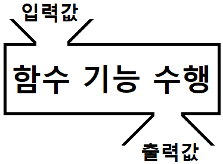
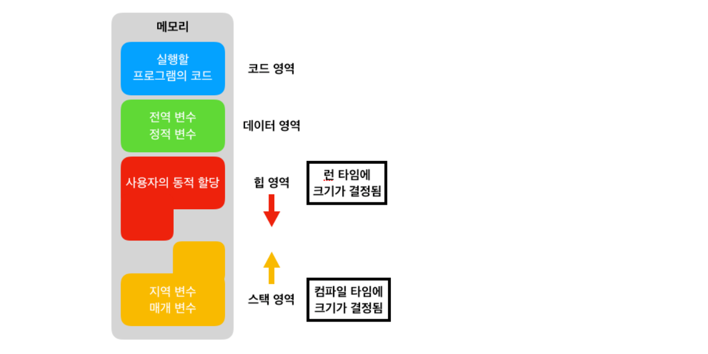
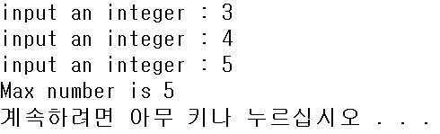
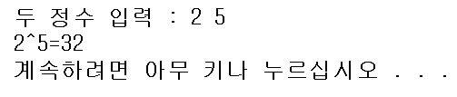
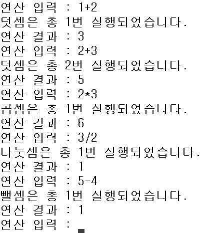
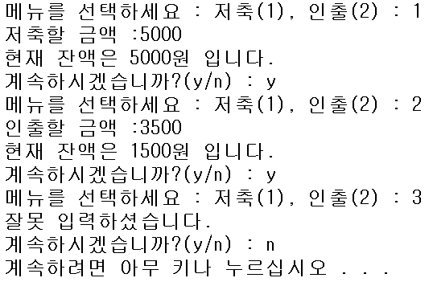

## Review

* printf, scanf
* 변수
* 연산자
* 조건문
* 반복문

 


## 함수

### 함수란?

* function : 기능 / 이공계쪽에서는 '함수'...
* 수학에서의 함수? f(x), g(x) ... 다를 것 없음!



* x에 어떤 자료가 특정 자료형으로 들어갈 수도 안들어갈 수도 있으며, 특정한 기능을 수행하는 코드의 묶음!
* 사용자가 직접 정의해서 사용할 수도 있고, 라이브러리를 참조하여 이미 정의된 함수들을 가져다 쓸 수 있다.

 

 

### 기본 정의

#### 함수를 정의하는 형식

```c
// c에서
반환타입 함수이름(매개변수) {
    수행코드;
    [return 반환값;]
}

// 파이썬에서
def 함수이름():
	들여쓰기로 구분
	반환타입 없음
	[return 반환값]
```

 

#### 반환 타입

```c
// 함수를 호출한 곳에 값을 반환한다.
// 이 때 반환하는 값의 타입을 결정하는 것.

int sumOfOneAndTwo() {
    return 1+2;
    /*	or
    	int sum = 1 + 2
    	return sum;
    */
}

double averageOfScore() {
    return (99+97)/2
    /*	or
    	double avg = (99+97)/2
    	return avg;
    */
}

char returnRandomAlpha(){
    return rand()%26+65
}
// 반환 타입으로 모든 자료형이 될 수 있다. 구조체, 포인터도 마친가지..
    

// 메인함수의 반환 타입
int main() {
    ...
	return 0;
}

void main() {
    ...
}


// printf 함수의 반환 타입
int printf(const char* format, ...); // 출력된 전체 문자의 개수를 반환한다.

// scanf ... 등등 만들어진 함수들 모두 '반환 타입'을 가지고 있다. 우리가 반환 값을 사용하지 않을 뿐.
```

* [printf()의 반환값](https://modoocode.com/35)
* 함수 reference를 확인하는 습관

 

#### 매개 변수(Parameter), 함수의 인자(Argument)

* 인자는 전달된 **값** 자체
* 매개 변수는 전달된 인자를 받는 **변수**

```c
int main() {
	int sum = addNumbers(10, 20); // 인자
    printf("%d\n", sum);
    return 0;
}

int addNumbers(int num1, int num2) { // 매개변수
    return num1 + num2;
}
```


- 굳이 따지고 보면 함수가 호출될 때, 전달받은 값을 저장할 매개변수를 할당하여 저장하는 것!
- 메모리적인 관점에서 생각 필요... 지역 변수, 전역 변수 등 개념!!

 

### 함수의 선언부

> '함수 원형' 이라고 불리는 함수의 선언을 왜 해줄까?

* 기본적으로 C는 '절차지향적인 언어', 반드시 호출 전에 먼저 선언 되어있어야 함.
* 함수 선언을 해줌으로 컴파일러에게 알려주어 에러 검출에 도움!
  * 함수 리턴 값 바르게 처리
  * 함수 인자 개수 확인
  * 전달 인자의 데이터 타입 확인
* 아래의 경우, 에러 발생!

```c
#include <stdio.h>

int main() {
    int sum = addNumbers(10, 20); // 인자
    printf("%d\n", sum);
    return 0;
}

int addNumbers(int num1, int num2) { // 매개변수
    test(); // test() 가 정의되지 않았습니다.
    return num1 + num2;
}

void test() {
    printf("hello");
}
```

 

* '이런 함수가 정의 되어있어' 하고 미리 알려주는 역할

```c
#include <stdio.h>

int addNumbers(int, int); 	// 선언 형식, 매개변수 '이름'은 생략 가능하다.
void test();				// 함수 원형

int main() {
    int sum = addNumbers(10, 20);
    printf("%d\n", sum);
    return 0;
}

int addNumbers(int num1, int num2) {	// 함수 정의
    test();
    return num1 + num2;
}

void test() {
    printf("hello");
}
```

* 또, 코드가 길어지면... 함수 찾기도 힘듦...
* 또, 함수의 정의를 먼저 하다보니 정작 메인인 main() 함수가 맨 아래로 가게 된다.

 

 

### 호출 과정

[함수 사용하기 C 코딩도장](https://dojang.io/mod/page/view.php?id=521)


* 하나의 프로그램(프로세스)에는 하나의 main() 함수!!
* main() 이 실행되다가 함수를 호출하면 main() 의 일은 잠시 멈추고 호출 함수로 가서 수행한다.
* 수행을 마치고 다시 호출한 main() 으로 돌아가 일을 계속한다.
* 이후에 스택 개념..!!


```c
#include <stdio.h>

int addNumbers(int, int); 	// 선언 형식, 매개변수 '이름'은 생략 가능하다.
void test();				// 함수 원형

int main() {
    int sum = addNumbers(10, 20);
    printf("%d\n", sum);
    return 0;
}

int addNumbers(int num1, int num2) {	// 함수 정의
    test();
    return num1 + num2;
}

void test() {
    printf("hello");
}
```


 

 

### 메모리 할당 개념

* 지역변수, 전역변수, 정적변수 등 메모리적인 관점 필요!!
* 변수든 함수든 사용하기 위해서는 메모리가 할당 되어야
* [정적 변수 c 코딩 도장](https://dojang.io/mod/page/view.php?id=690)


#### 지역변수

* { } 괄호 안에서만 쓸 수 있는게 지역변수
* main { } / function { } / for { } / while { } 
* 블록을 벗어나면 메모리 할당 해제

```c
void func(){
    int localValue = 10;
}

int main() {
    int num = 10;
    printf("%d", localValue); // 사용 불가!
}
```


#### 전역변수

* 전 지역에서 쓸 수 있는 변수
* 기본적으로 하나의 프로그램에서는 어디서든 쓸 수 있다.
* 외부 파일의 전역 변수 등을 extern 키워드를 이용해 참조할 수 있다.

```c
#include <stdio.h>

// 헤더파일, .c 파일 등 외부파일 만들어서 참조
extern 외부 라이브러리, API, 전역변수 등을 참조해 사용 가능

int global_value; // 전역변수. 다만, 스파게티 코드 라고 해서 전역변수를 많이 쓰면 안좋다.
void show();

int main(){
	global_value = 10; // 사용 가능
	show();
}

void show() {
    printf("%d\n", global_value); // 사용 가능
}
```


#### 정적변수 

* 지역변수로 선언했어도, 프로그램이 끝날 때까지 메모리를 계속 유지하는 변수
* 값을 처음에 한 번 초기화 하면, 다시 초기화 할 수 없다.
* 즉, 지역변수이면서 정적변수일 수 있다.

```c
void plusNum() {
	static int num = 0; // 함수가 처음 호출될 때 수행, 두 번째부터는 무시!
    num++;
}
```

* 전역변수이면서 정적변수일 수도 있는데, 이 경우에는 전역변수를 외부에서는 참조할 수 없다.
* 즉, 해당 프로그램(.c 파일) 안에서만 사용하도록 제한할 때 전역변수에 static을 붙인다.
* 다시 정리하면 정적 전역 변수는, 선언한 .c 파일 내에서 어디서든 사용할 수 있다.


#### 메모리

[Memory Structure1](https://jinshine.github.io/2018/05/17/%EC%BB%B4%ED%93%A8%ED%84%B0%20%EA%B8%B0%EC%B4%88/%EB%A9%94%EB%AA%A8%EB%A6%AC%EA%B5%AC%EC%A1%B0/)

[Memory Structure2](https://bskyvision.com/160)

(꼭 시간내서 읽어보는 것 추천)




#### code

* 실행할 프로그램의 **코드**가 들어가는 부분
* 작성한 **소스 코드**가 저장되는 영역이다.


#### data

* 프로그램이 **시작과 동시에 할당** 되고, **종료될 때** 사라지는 영역
* 그렇기 때문에 한번 초기화 하면 다시 초기화 할 수 없다

* **정적변수**(static), **전역변수**


#### heap

* 프로그래머가 관리할 수 있는 유일한 영역
* **프로그래머에 의해** 메모리를 할당 / 해제 할 수 있는 메모리 공간이다.
* 동적 메모리 할당 (Dynamic Memory Allocation)
  * malloc(), realloc(), ... free() 등...


#### stack

* 프로그램 수행 도중 호출될 때 할당 / 수행 끝나면 사라지는 영역
* 함수, 매개변수, 지역변수 등...
* Last In First Out 형태의 자료구조 의미도 가지고 있다.


### 함수 종료 조건

> 함수가 호출이 되고 종료하게 되는 조건은?

* return
  * void 일 때는 함수 내부 코드의 수행이 끝나면 자동 종료
  * void 일 때도 return ; 하면 함수를 종료한다.
* Error 때문에 아예 프로그램이 종료되는 경우
* exit()
  * main() 함수 자체를, 즉 프로그램 자체를 종료하는 함수

* while, for 조건문 등은 break;


> 재귀 호출?

* 함수 안에서 함수 자기 자신을 호출하는 것
* 팩토리얼 (!) 구현할 때 / 정렬 알고리즘 사용할 때 (Quick sort) 등의 예시
* 효율적인 경우에만 사용하는 것이 좋다.

```c
// 1부터 입력한 숫자까지 모두 더하는 함수 (1+2+3+...+num) - 재귀함수
int sumOfoneToNum(int num) {
    if(num > 1)
        return num + addAllNum(num-1);
    else
        return 1;
}
```


### 명령행 인자

* 메인 함수에도 매개변수를 넣어서, 프로그램을 실행할 때 인자를 넣어주는 것
* int main(int argc, char *argv);

```c
#include <stdio.h>

int main(int argc, char* argv) {
	printf("입력한 인자의 개수를 나타내는 argc값은 %d입니다.", argc);
	
	for(int i=0; i<argc; i++)
		printf("%s\n", argv[i]);
}
```

* 한번 찾아서 자율적으로 공부해보기. 처음엔 이해 안되고 좀 어려울 듯.
* 포인터, 배열부분 공부한 후 보면 그나마 이해 될 듯.

 


### 함수를 공부할 때 생각하며 볼 부분

* 어떤 기능을 수행하나?
* 매개변수로 주는 인자가 무엇인가?
  * 타입은 뭔지
  * 개수는 몇개인지
* 반환값은 있는가?
  * 타입은 뭔지
* 어떤 원리인가?


## 배열 . . . . 은 간단하게만 살펴보고 다음주에 다시!

* int arr[**5**] = {1,2,3,4,5}

* 접근 index로

* **동일한 타입**의 변수들의 집합 // **C언어**에서.  파이썬은 다른 타입도 됨. **list** 

  * 구조체

    * 다른 타입 내가 임의로 합해서 정의한 새로운 타입.

    * [ int, char[4] ]  하나의 변수 타입으로 지정한 게 구조체

    * struct myType {

      ​	int a;

      ​	char t[4];

      }

  * index 0부터 접근!! **arr[0] ~ arr[4]**

* 배열의 이름은 **배열의 첫 번째 주소**~!!

* 사용을 할 때 arr[0]     // arr 첫 번째 주소!!

* **메모리적인 관점에서 생각!!!**


 

## 과제

 

### 세 정수를 입력받아 가장 큰 수를 찾는 프로그램

* 정수를 입력받아 반환하는 inputNumber() 함수를 구현하시오.
* 정수 세 개를 인자로 넘겨 Max 값을 반환하는 findMax( ) 함수를 구현하시오.
  * 함수 응용



 

 

### 두 정수 a, b를 입력 받아 a의 b제곱을 구하는 프로그램

* 정수를 입력받아 반환하는 inputNumber() 함수를 구현하시오.
* a, b 값을 인자로 넘겨 a^b를 계산해 반환하는 power( ) 함수를 구현하시오.
  * 함수, 반복문 응용



 

 

### 계산기 프로그램

* 두 정수의 사칙연산을 수행하는 계산기 프로그램을 작성하시오.
* 덧셈, 뺄셈, 곱셈, 나눗셈을 수행해 반환하는 plus, minus, mult, division 함수를 각각 구현하시오.
* 반복문을 이용해 다음 기능들이 무한 반복 되도록 구현하시오. (ctrl + c 입력시 종료)
  * [숫자 문자 숫자] 를 입력받아 정수와 연산자를 변수에 입력받으시오.
  * 연산자의 종류에 따라 사칙연산 함수를 호출하여, 몇 번 호출 되었는지를 출력하시오.
  * 연산의 결과를 출력하시오.
* 조건문(switch), 반복문, 함수 응용




### ATM 프로그램

* 사용자가 메뉴를 선택해 저축과 인출을 할 수 있는 ATM 프로그램을 구현하시오.
  * 잔액에 대한 변수는 전역 변수로 선언하시오.
  * 저축을 수행하는 함수 save()와 인출을 수행할 함수 draw()를 구현하시오.
    * 조건문, 반복문, 함수, 전역변수 응용

```c
int main() {
	...

	    --- 반복 ---	
        
	// if 1 선택시
        저축할 금액 입력
        save 함수 호출

    // else if 2 선택시
        인출할 금액 입력
        draw 함수 호출
        
	// 1, 2를 제외한 숫자 입력시
        에러 메시지 출력

	계속 하시겠습니까?
        
        --- 반복 ---        
}
```




### 입력한 숫자 팩토리얼의 값을 구하는 프로그램

* 정수 n을 입력 받아, n! 의 값을 구하는 아래 경우의 프로그램을 구현하시오.
  * 반복문을 이용해 구현하는 경우
  * 재귀함수를 이용해 구현하는 경우
    * 5! = 5 x 4 x 3 x 2 x 1


