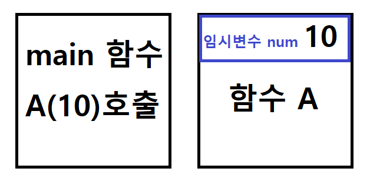
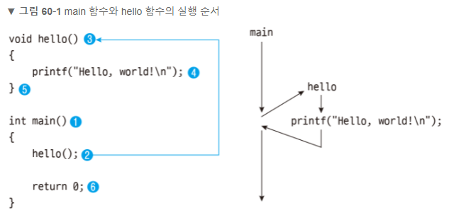
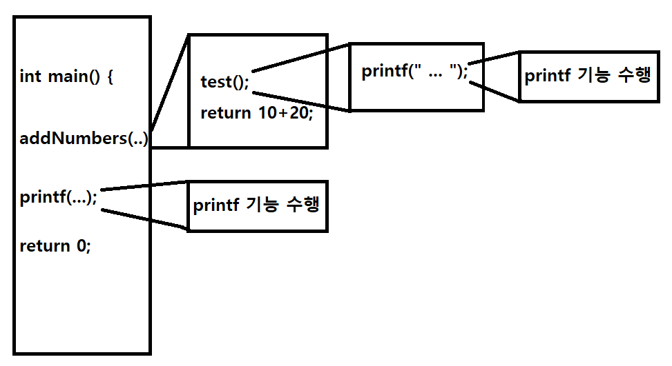

## Review

* printf, scanf
* 변수
* 연산자
* 조건문
* 반복문

 


## 함수

### 함수란?

* function : 기능 / 이공계쪽에서는 '함수'...
* 수학에서의 함수? f(x), g(x) ...
* 다를 것 없음!!
* x에 어떤 자료가 특정 자료형으로 들어갈 수도 안들어갈 수도 있으며, 특정한 기능을 수행하는 코드의 묶음!

 

 

### 기본 정의

#### 함수를 정의하는 형식

```c
// c에서
반환값자료형 함수이름() {
    수행코드;
    [return 반환값;]
}

// 파이썬에서
def 함수이름():
	들여쓰기로 구분
	반환타입 없음
	[return 반환값]
```

 

#### 반환 타입

```c
// 함수를 호출한 곳에 값을 반환한다.
// 이 때 반환하는 값의 타입을 결정하는 것.

int sumOfOneAndTwo() {
    return 1+2;
    /*	or
    	int sum = 1 + 2
    	return sum;
    */
}

double averageOfScore() {
    return (99+97)/2
    /*	or
    	double avg = (99+97)/2
    	return avg;
    */
}

// 메인함수의 반환 타입
int main() {
    ...
	return 0;
}

void main() {
    ...
}

// printf 함수의 반환 타입
int printf(const char* format, ...); // 출력된 전체 문자의 개수를 반환한다.

// scanf ... 등등 만들어진 함수들 모두 '반환 타입'을 가지고 있다. 우리가 반환 값을 사용하지 않을 뿐.
```

* [printf()의 반환값](https://modoocode.com/35)
* 함수 reference를 확인하는 습관

 

#### 매개 변수(Parameter), 함수의 인자(Argument)

* 인자는 전달된 **값** 자체
* 매개 변수는 전달된 인자를 받는 **변수**

```c
int main() {
	int sum = addNumbers(10, 20); // 인자
    printf("%d\n", sum);
    return 0;
}

int addNumbers(int num1, int num2) { // 매개변수
    return num1 + num2;
}
```



- 굳이 따지고 보면 함수가 호출될 때, 전달받은 값을 저장할 매개변수를 할당하여 저장하는 것!
- 메모리적인 관점에서 생각 필요... 지역 변수, 전역 변수 등 개념!!

 

### 함수의 선언부

> '함수 원형' 이라고 불리는 함수의 선언을 왜 해줄까?

* 기본적으로 C는 '절차지향적인 언어', 반드시 호출 전에 먼저 선언 되어있어야 함.
* 함수 선언을 해줌으로 컴파일러에게 알려주어 에러 검출에 도움!
  * 함수 리턴 값 바르게 처리
  * 함수 인자 개수 확인
  * 전달 인자의 데이터 타입 확인
* 아래의 경우, 에러 발생!

```c
#include <stdio.h>

int main() {
    int sum = addNumbers(10, 20); // 인자
    printf("%d\n", sum);
    return 0;
}

int addNumbers(int num1, int num2) { // 매개변수
    test(); // test() 가 정의되지 않았습니다.
    return num1 + num2;
}

void test() {
    printf("hello");
}
```

 

* '이런 함수가 정의 되어있어' 하고 미리 알려주는 역할

```c
#include <stdio.h>

int addNumbers(int, int); 	// 선언 형식, 매개변수 '이름'은 생략 가능하다.
void test();				// 함수 원형

int main() {
    int sum = addNumbers(10, 20);
    printf("%d\n", sum);
    return 0;
}

int addNumbers(int num1, int num2) {	// 함수 정의
    test();
    return num1 + num2;
}

void test() {
    printf("hello");
}
```

* 또, 코드가 길어지면... 함수 찾기도 힘듦...
* 또, 함수의 정의를 먼저 하다보니 정작 메인인 main() 함수가 맨 아래로 가게 된다.

 

 

### 호출 과정

[함수 사용하기 C 코딩도장](https://dojang.io/mod/page/view.php?id=521)



* 하나의 프로그램(프로세스)에는 하나의 main() 함수!!
* main() 이 실행되다가 함수를 호출하면 main() 의 일은 잠시 멈추고 호출 함수로 가서 수행한다.
* 수행을 마치고 다시 호출한 main() 으로 돌아가 일을 계속한다.
* 이후에 스택 개념..!!


```c
#include <stdio.h>

int addNumbers(int, int); 	// 선언 형식, 매개변수 '이름'은 생략 가능하다.
void test();				// 함수 원형

int main() {
    int sum = addNumbers(10, 20);
    printf("%d\n", sum);
    return 0;
}

int addNumbers(int num1, int num2) {	// 함수 정의
    test();
    return num1 + num2;
}

void test() {
    printf("hello");
}
```



 

 

### 메모리 할당 개념

* 지역변수, 전역변수, 정적변수 등 메모리적인 관점 필요!!
* [정적 변수 c 코딩 도장](https://dojang.io/mod/page/view.php?id=690)


#### 지역변수

* { } 괄호 안에서만 쓸 수 있는게 지역변수
* main { } / function { } / for { } / while { } 

```c
void func(){
    int localValue = 10;
}

int main() {
    int num = 10;
    printf("%d", localValue); // 사용 불가!
}
```


```
외부에 헤더파일 만드는거...?
외부 파일로 .c 만들어서

#include <stdio.h>

extern 외부 라이브러리, API 같은거

// 여기 선언되는거 전역변수
int global_value; // 스파게티 코드.. 라고 해서 많이 쓰면 안좋다...

main{ }
.c 에서만, 쓸 수 있게. static

```

* **종료 조건?**

  * 함수 호출.
  * return 하는거.
  * return이 없을 때 void일때는 수행이 다 끝나면 수행
  * Error 때문에 아예 프로그램이 종료되는...
  * while, for 조건문  등등... break;

* 재귀 호출?

  * 함수 호출, 함수 안에서 호출하는거..


 

 

### 명령행 인자

* 메인 함수에도 매개변수를 넣어서, 프로그램을 실행할 때 인자를 넣어주는 것
* int main(int argc, char *argv);

```c
#include <stdio.h>

int main(int argc, char* argv) {
	printf("입력한 인자의 개수를 나타내는 argc값은 %d입니다.", argc);
	
	for(int i=0; i<argc; i++)
		printf("%s\n", argv[i]);
}
```

* 한번 찾아서 자율적으로 공부해보기. 처음엔 이해 안되고 좀 어려울 듯.
* 포인터, 배열부분 공부한 후 보면 그나마 이해 될 듯.

 

 

 

## 과제

 

### 세 정수를 입력받아 가장 큰 수를 찾는 프로그램

* 정수를 입력받아 반환하는 inputNumber() 함수를 구현하시오.
* 정수 세 개를 인자로 넘겨 Max 값을 반환하는 findMax( ) 함수를 구현하시오.
  * 함수 응용


 

 

### 두 정수 a, b를 입력 받아 a의 b제곱을 구하는 프로그램

* 정수를 입력받아 반환하는 inputNumber() 함수를 구현하시오.
* a, b 값을 인자로 넘겨 a^b를 계산해 반환하는 power( ) 함수를 구현하시오.
  * 함수, 반복문 응용


 

 

### 계산기 프로그램

* 두 정수의 사칙연산을 수행하는 계산기 프로그램을 작성하시오.
* 덧셈, 뺄셈, 곱셈, 나눗셈을 수행해 반환하는 plus, minus, mult, division 함수를 각각 구현하시오.
* 반복문을 이용해 다음 기능들이 무한 반복 되도록 구현하시오. (ctrl + c 입력시 종료)
  * [숫자 문자 숫자] 를 입력받아 정수와 연산자를 변수에 입력받으시오.
  * 연산자의 종류에 따라 사칙연산 함수를 호출하여, 몇 번 호출 되었는지를 출력하시오.
  * 연산의 결과를 출력하시오.
* 조건문(switch), 반복문, 함수 응용


