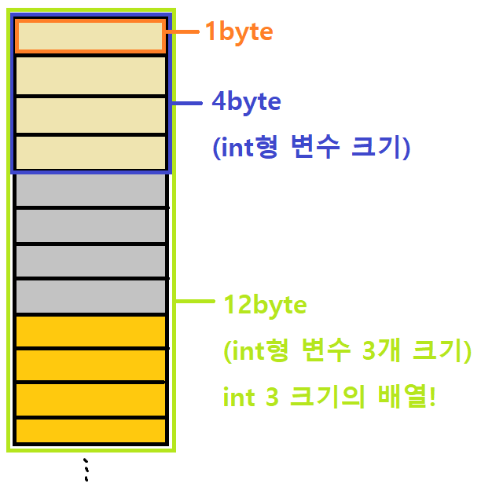

## Review

* 함수
* 간단한 [review quiz](./4주차_quiz.md)!
* 정의 형식
  * 반환타입, 함수이름, 매개변수
  * 선언부, 반환값
* 지역변수, 전역변수, 정적변수


## 배열

### 배열이란?

* **동일한 타입**의 변수들의 집합 // **C언어**에서.  파이썬은 다른 타입도 됨!!! **list** 

* 변수를 하나하나 선언 할 수도 있지만.. 번거로움을 막기위해!

  ```c
  int arr[5] = {1,2,3,4,5}
  ```


### 선언 구문

* 자료형 배열이름 [배열 크기]

```c
int arr[10]; // 선언
double values[3] = {99.8, 87.5, 100.0}; // 선언과 동시에 초기화
char str[10] = "string"; // 선언과 동시에 초기화
```


### 원소 접근

* 배열 선언 후 배열 원소에 접근하려면 배열 이름 뒤에 대괄호 사이 첨자(index)를 이용

```c
int nums[3] = {10, 20, 30};

nums[0] : 10
nums[1] : 20
nums[2] : 30
```

* 인덱스는 0부터 시작. 컴퓨터는 1이 아닌 0부터 시작이다!
* 선언할때 [ ] 안에는 선언할 배열의 '크기'
* 후에 배열에 접근할 때는 그 크기-1 만큼.  0 ~ 크기-1


```c
nums[3]; // error
nums[10]; // error
```

* 유효 범위를 벗어나 참조하면 실행 오류가 발생한다!


#### 메모리적인 관점

* %p를 이용하면 해당 변수(메모리)의 **주소**가 출력된다.

```c
printf("%p", nums);
printf("%p", nums[0]);
printf("%p", nums[1]);
printf("%p", nums[2]);
```

* '주소' 개념 매우 중요. 포인터 부분에서 다시 언급.
* **배열의 이름은 배열의 첫 번째 주소이다.** 이 문장을 인지만 하고 넘어가자.




* 컴퓨터 어딘가의 메모리에 변수들이 크기만큼 할당
* int형 변수는 크기 4byte
* int 배열은, int형 변수가 여러 개 있는 것!
* 해당 크기만큼 메모리가 할당


* 메모리적인 관점에서 보면, **int nums[3] = {10, 20, 30}** 은 위와 같은 상태로 저장되어 있음
* 메모리적인 관점에서 개념적으로 이해하고 넘어가자!


#### 원소 접근 에러


* 위에서 유효 범위를 벗어나 참조하면 실행 오류가 발생한다! 라고 한 부분.
* nums[3] ?? 분명 0~2까지 크기 3만큼만 할당했기 때문에, 설정되지 않은 부분을 참조하기에 에러가 나는 것!


### 배열의 사용

* 사용 방법 예제 (배열의 접근 방법을 응용해 사용하면 됨)

```c
int nums[3] = {20, 30, 10};

printf("nums[0] : %d\n", nums[0]);
printf("nums[1] : %d\n", nums[1]);
printf("nums[2] : %d\n", nums[2]);

// 길어지면 하나하나 언제 입력하나.. for문으로
for 
```


*  위 nums 안의 숫자를 30, 20, 10으로 변경

```c
int temp;

temp = nums[0];
nums[0] = nums[1];
nums[1] = temp;

/*
 nums[0] : 30
 nums[1] : 20
 nums[2] : 10
*/
```


* nums를 모두 0으로 초기화

```c
nums[0] = 0;
nums[1] = 0;
nums[2] = 0;

/*
 nums[0] : 0
 nums[1] : 0
 nums[2] : 0
*/

// 길어지면 하나하나 언제 입력하나.. for문으로
for 
```


* 배열에 국영수 점수를 입력받아 평균 구해 출력

```c
int scores[3];

scanf("%d, %d, %d", &scores[0], &scores[1], &scores[2]);
printf("");
```


* 크기 10의 int형 배열 randNums를 선언하여, 랜덤 숫자들을 순차적으로 입력받고, 이를 모두 더해 평균을 구한 값과, 각각 숫자들을 모두 출력하는 프로그램 (실습 : 7분)

```c
#include <stdio.h>
#include <stdlib.h>
#define SIZE 10

int main() {
    // 크기 10 int형 배열 randNums[] 선언
    // 추가적으로 필요한 변수 선언
    
    srand((unsigned)time(NULL));
    
    // randNums[] 0 ~ 9까지 random 숫자 대입
    for(    ) {
        
    }
    
    // randNums[] 0 ~ 9까지 모두 더해 평균을 구함
    for(    ) {
        
    }    
    
    // randNums[] 0 ~ 9까지 각각 출력
    for(    ) {
        
    }
    
    return 0;
}
```


## 이차원 배열

* 행과 열 구조, 대괄호 두 개 필요
* x축 하나만 있다가, x축 y축 두 개로 늘어난 것!!
* 1차원 -> 2차원!!


### 선언 구문

* 자료형 배열이름 [배열 행크기] [배열 열크기]

```c
int arr[2][4]; // 선언

int arr2[2][4] = {{1,2,3,4}, {5,6,7,8}}; // 선언과 동시에 초기화
char str[4][10] = {"hello", "test", "string", "hi"}; // 선언과 동시에 초기화
```

* 행렬에서 헷갈리기 쉬운 부분..
* 행(Row) 부분은, **가로 줄이 몇 줄인지**
* 열(Column) 부분은, **세로 줄이 몇 칸인지**


### 원소 접근

> 차원이 하나 늘어났을 뿐, 일차원 배열과 동일하다.

* 인덱스는 0부터 시작.
* 선언할때 [ ] 안에는 선언할 배열의 '크기'
* 후에 배열에 접근할 때는 그 크기-1 만큼.  0 ~ 크기-1
* 위의 경우 접근 가능한 범위는

```
arr2[0][0] 부터 ~ arr2[1][3] 까지
str[0][0] 부터 ~ str[3][9] 까지
```


* 유효 범위를 벗어나 참조하면 실행 오류가 발생한다!

```c
arr2[2][0]; // error
str[0][10]; // error
```


### 이차원 배열의 사용

* 사용 방법 예제 (배열의 접근 방법을 응용해 사용하면 됨)

```c
int nums[2][2] = {{1,2},{4,5}};

printf("nums[0][0] : %d\n", nums[0][0]);
printf("nums[0][1] : %d\n", nums[0][1]);
printf("nums[1][0] : %d\n", nums[1][0]);
printf("nums[1][1] : %d\n", nums[1][1]);


// 길어지면 하나하나 언제 입력하나.. 이중 for문으로
for () {
    for () {
        
    }
}
```


* 마찬가지. 해당 인덱스로 접근해서 값을 바꾸거나 할 수 있다!

```c
nums[1][1] = 10;
```


* 배열에 두 학생의 국영 점수를 입력받아 평균 구해 출력

```c
int studentsScores[2][2];

scanf("%d, %d, %d, %d", &studentsScores[0][0], &studentsScores[0][1], &studentsScores[1][0], &studentsScores[1][1]);
printf("");
```


#### 메모리적인 관점

* 포인터 배울 때 다시 언급 예정


## 포인터

### 포인터의 이해


#### 포인터란?

* 포인터 == 주소
* ~의 포인터 라는 문장 == ~의 주소
* 따라서 포인터 변수란, 주소를 담는 변수

```c
int num = 10;
int *ptr = &num; // & : 앰퍼샌드. 주소.
```


* 10이라는 **값**을 담고있는 int형 변수 num
  * int 형 데이터를 자료로 담는 변수 num
* **주소** 0x1154를 담고있는 int형 포인터 변수 ptr
  * int* 형 데이터를 자료로 담는 변수 ptr
  * int형 변수의 주소를 자료로 담는 변수 ptr


* 


* num에는 10이라는 값이 들어있음.
* int* ptr 에는 num의 주소인 0x1154 가 들어있음.
* 즉, ptr은 num을 가리키고 있다. == ptr은 변수 num의 주소를 담고 있다.


#### 포인터 변수의 크기

* 모든 포인터 변수의 크기는 4byte 이다? -> 정확한 표현이 아님.
* 포인터 변수의 크기는, 주소를 나타내는 크기에 따라 다르다.
* 즉, 컴파일 되는 컴파일러의 bit 방식. 32bit / 64bit냐? 에 따라서 달라진다.
* 우리는 32bit 형식으로 코딩하다 보니까 4byte.


#### 포인터 사용


* 자주 나는 에러
  * **NullPointerException**
    * Null 비어있다. 0 NULL 가리키는게 아무것도 없는 포인터 변수를 참조할 때.
    * int *p = NULL
    * printf ("  %d",   *p );
  * **IndexOutOfRange** (**Bound**) // 배열에서
    * 인덱스를 벗어났을 때.
* 2차원 포인터, n차원 ...


* **배열** / **포인터**

  * int p1[3] = {1,2,3}
  * int *p2 = p1

  

  * for
  * %__  , &p1[i]

  

  1. 넘겨주는 값이 어떤건지,
  2. 받은 값이 어떤건지.

  

  **주소를 넘겨줄거냐?  값을 넘겨줄거냐?**

  **Call by reference?  Call by value?**

  

  * function (p1) {
    	(p1[])

  * }

    

  * **하나 하나 해보면서 이해하는거**

  * **포인터의 주소 출력, 배열의 주소출력, 인덱스별로 추소 증가시키며 출력해보기**

  * 동일한 타입의 변수들의 집합

  * 배열의 이름은 배열의 첫 번째 주소


#### **포인터는 주소!!!**

* **포인터 배열**
  * char 형 배열 / int 형 배열 / double 형 배열
  * **char\***형 배열 / **int\***형 배열 
  * int *p[3]
  * 배열의 요소로 '포인터 값', 즉... **주소를 값으로 가지는 배열**
* **배열 포인터**
  * int (*p)[5]
  * **특정 크기 형식의 배열을 가리키는 포인터**
  * **char형 ***, **int형 ***, **struct ***, ... **int [5]** 형 포인터!
  * [참고](https://blockdmask.tistory.com/56)

* **함수 포인터**
  * 반환타입 (*함수이름)(매개변수)
  * [참고](https://blog.naver.com/tipsware/221286052738)


## 함수와 배열

* 함수에 배열을 넘기는 방법


* 배열 최대 **최솟값**  찾기 / **정렬하기**
* 배열을 함수로 넘겨 모든 요소를 출력하는 함수 / 최댓값, 최솟값 찾아 출력하는 함수
* 1~10까지 입력한 빈도수, 가장 많이 입력한 수와 빈도 출력하는 함수
* 배열 arr를 매개변수로 넘겨 오름차순 or 내림차순 sort하는 함수
* 배열 두 개를 매개변수로 넘겨 같은 배열이면 같다, 다르면 다르다 출력하는 함수
* 2차원 배열 A, B를 선언하여 두 배열에 대해 행렬의 덧셈, 뺄셈 연산을 수행하는 함수
* 2차원 배열을 선언하여 매개변수로 넘겨 전치행렬을 만들어 저장해 출력하는 함수
* 2차원 배열 A, B를 선언하여 두 배열에 대해 행렬 곱셈연산을 수행하는 함수


#### 


* 평점(4.5 만점) grade 정보가 주어질 때, 평점을 점수(100 만점)로 환산한 배열 출력하는 함수
* 3차원 배열을 넘겨 1면, 2면으로 나누어 출력하는 함수
* 5개의 데이터를 입력한 배열을 매개변수로 넘겨주어, 모든 요소를 출력하는 함수 / max 찾는 함수
* (2, 4) 2차원 배열 8개의 값을 매개변수로 넘겨 포인터 형식 접근 / 2차원 배열 접근으로 Sum 반환 함수
* (5, 5) 배열에 (4, 4) 값이 주어질 때, 매개변수로 넘겨 가로 합, 세로 합을 구해 넣는 함수 / 출력하는 함수
* 전치행렬 만드는 함수
* 중간, 기말 점수가 2차원 배열로 주어질 때, 매개변수로 넘겨 합을 구하는 함수 / 각 평균, 전체 평균 출력