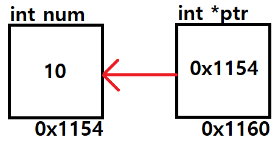
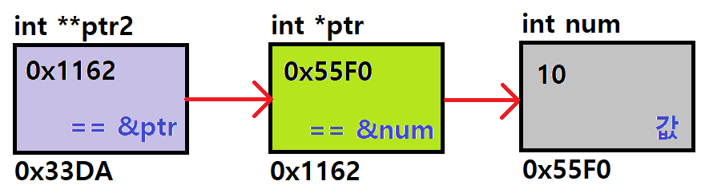

## Review

* 포인터 == 주소
* 포인터 변수 : **주소**를 담는 변수

```c
int num = 10;
int* ptr = &num; // & : 앰퍼샌드. 주소.
```




* 포인터 변수 ptr이 num을 가리킨다 라고 표현하기도 함.
  * num은 10
  * ptr은 &num, 즉 0x1154
  * *ptr은 num, 즉 10
* 역참조 연산자 * : 주소값에 접근하여 해당 주소에 저장되어 있는 값을 참조함


* 포인터 변수의 크기는 컴파일러의 bit 방식에 따라서 달라진다.
  * 우리는 32bit 형식으로 코딩하다 보니까 4byte.


* 포인터의 사용

```c
int *ptr = NULL; // 처음에 초기화를 안해줄 땐, NULL로 초기화 하는게 일반적
int num = 10;
ptr = &num;		// 포인터 변수 ptr에 num의 주소를 대입
```


* Call by value : **값**이 복사되어 넘겨지는 것

```c
void changeValue(int n);

void main() {
	int num = 10;
	
	printf("%d", num); // 10
	changeValue(num);  // 값이 복사되어 넘겨지는 것
	printf("%d", num); // 10
}

void changeValue(int n) {
	n = 20;
}
```


* Call by reference : **주소**가 복사되어 넘겨지는 것

```c
void changeValue(int* n);

void main() {
	int num = 10;
	
	printf("%d", num); // 10
	changeValue(&num); // 주소가 복사되어 넘겨지는 것
	printf("%d", num); // 20
}

void changeValue(int* n) {
    *n = 20;
}
```

* **주소**를 넘겨주면, 해당 메모리의 주소에 직접 접근 할 수 있는 것!!
* **배열의 이름은 배열의 첫 번째 주소** == 배열의 **이름**은 배열의 포인터


* 배열을 함수에 넘겨, 포인터 접근 방식으로 순차적으로 출력해보는 코드

```c
#include <stdio.h>

void printArray(int*, int);

void main() {
	int nums[5] = {1,2,3,4,5};

	printArray(nums, sizeof(nums)/sizeof(nums[0])); // (&nums) 또는 (&nums[0])
}

void printArray(int* arr, int size) {
    
    // 인덱스 접근 방식
    for (int i=0; i<size; i++) {
        printf("arr[%d] = %d\n", i, arr[i]);
    }

    // 주소 접근 방식
    for (int i=0; i<size; i++) {
        printf("*arr+%d = %d\n", i, *arr+i);
    }
}
```


### 지나가는 깜짝 Quiz


#### 다음 빈칸의 코드를 완성하시오.

* 인덱스 접근 방식으로 배열에 접근 및 사용 할 수 있는지?

```c
#include <stdio.h>
#define SIZE 5

int main() {
    int arr[5] = {90,97,99,98,100};
    int sum = 0;
    
    for (int i=0; i<SIZE; i++) {
        if ( 1) ______ ) {	// arr의 요소가 짝수이면 (인덱스 접근 방식으로 할 것)
			 2) __________	// sum에 해당 요소를 더하라 (인덱스 접근 방식으로 할 것)
        }
        printf("3) ____ = %d\n", 3) ____ ) // 인덱스 접근 방식 요소 출력
    }
    
    printf("%d\n", sum);
    return 0;
}
```


1)  arr[i] % 2 == 0

2) sum += arr[i]

3) arr[i]


#### 다음 빈칸의 코드를 완성하시오.

* arr[i] (인덱스 접근 방식) 대신 포인터 접근 방식으로 주소 개념을 잘 이해하고 있는지?

```c
#include <stdio.h>
#define SIZE 5

int main() {
    int arr[5] = {90,97,99,98,100};
    int sum = 0;
    
    for (int i=0; i<SIZE; i++) {
        if ( 1) ______ ) {	// arr의 요소가 짝수이면 (포인터 접근 방식으로 할 것)
			 2) __________	// sum에 해당 요소를 더하라 (포인터 접근 방식으로 할 것)
        }
        printf("3) ____ = %d\n", 3) ____ ) // 포인터 접근 방식 요소 출력
    }
    
    printf("%d\n", sum);
    return 0;
}
```


1)  *(arr+i) % 2 == 0

2) sum += *(arr+i)

3) *(arr+i)


#### 다음의 출력 결과를 쓰시오.

* 주소 개념을 잘 이해하고 있는지?

```c
#include <stdio.h>

int main() {
    int arr[5] = {90,97,99,98,100};
    int* ptr = arr;
    
    printf("%p\n", &arr[0]);	// 0x1110 라고 한다면

    printf("%p\n", arr);		// 1) ____
    printf("%p\n", &arr);		// 2) ____
    printf("%p\n", ptr);		// 3) ____
    printf("%p\n", &ptr);		// 4) ____
    printf("%p\n", ptr+1);		// 5) ____
        
    printf("%d\n", ptr[3]);		// 6) ____
    printf("%d\n", *ptr);		// 7) ____
	printf("%d\n", (*ptr)++);	// 8) ____
    printf("%d\n", ++(*ptr));	// 9) ____
	printf("%d\n", *(ptr++));	// 10) ____
    printf("%d\n", *(++ptr));	// 11) ____

    return 0;
}
```


1) 0x1110

2) 0x1110

3) 0x1110

4) 주어진 정보로는 알 수 없다!

5) 0x1114


6) 98

7) 90

8) 90

9) 92

10) 92

11) 99


## 이차원 포인터

### 이차원 포인터의 이해

* 이차원 포인터는, 포인터의 포인터. 주소를 담는 변수인 **포인터 변수의 주소**를 담는 변수
* 즉, 이차원 포인터 변수가 담고 있는 변수의 값은 주소
  * 그 주소값을 참조(*)하면 해당 메모리에는 또다시 다른 변수의 주소를 값으로 담고 있는 것!



```c
int num = 10;
int *ptr = &num;
int **ptr = &ptr;
```

* 메모리를 그려서 구체적인 주소를 보면 아래와 같다.


* ptr2 == &ptr
* *ptr2 == ptr == &num
* **ptr2 == *ptr == num == 10


### 이차원 포인터의 사용

```c
int num = 10;
int *ptr = &num;
int **ptr2 = &ptr;

printf("%d == %d == %d \n", num, *ptr, **ptr2);
printf("%p == %p == %p \n", &num, ptr, *ptr2);
printf("%p == %p \n", &ptr, ptr2);

*ptr = 20;
printf("%d\n", num);

**ptr2 = 30;
printf("%d\n", num);
```


### 이차원 포인터와 이차원 배열

* 일차원 포인터와 일차원 배열의 경우, 앞서 Quiz에서 아주 적나라하게 알아보았다.
* 이차원 포인터와 이차원 배열 역시 마찬가지!

```c
int twoArr[2][2] = { {1,2},	{3,4} };
int** ptrptr = twoArr; // == &twoArr == twoArr[0] == &twoArr[0] == &twoArr[0][0]

printf("twoArr \t\t= %p\n", twoArr);
printf("&twoArr \t= %p\n", &twoArr);
printf("twoArr[0] \t= %p\n", twoArr[0]);
printf("&twoArr[0] \t= %p\n", &twoAr[0]);
printf("&twoArr[0][0] \t= %p\n", &twoArr[0][0]);
```

* 이차원 배열이란, 일차원 배열의 이름들을 담고있는 배열
  * 즉, 배열의 주소들을 담고있는 배열
  * 즉, 주소들을 담은 배열
  * 즉, 이차원 포인터


## 문자열

* **<string.h> 헤더파일!!**

* <math.h>

* <stdio.h>

  * printf, scanf  정의, 매개변수는. 어떤 역할?

  

* 프로그래밍 언어라는걸 배움.

* 기본적으로는 문법

  * 반복문, 조건문, 배열 list , 등등.. 
  * 프로그램을 짜는건데,
  * 함수들이 미리 정의 된 것들 


* C언어에서는 char형 배열을 의미하기도 하고, 문자열 상수를 말하기도 한다.
* char str[10] = "캐릭터 배열"
* char *str2 = "문자열상수"


#### 포인터 형식의 문자열 / 배열 형식의 문자열의 차이?

* 선언과 동시에 초기화??

  * O / O

    * char str[10] = "캐릭터 배열"
    * char *str2 = "문자열상수"

    

* 선언 후 초기화?, 수정!

  * 포인터 X / 배열 O

    * char *str2 = "string_const"
    * printf("%c", str2[1])
    * str2[1] = 'x'  // X

    

    * char str[10];
    * str = "charactor"
    * str[1] = 'a';
    * "caaractor"

    

* 문자열 입력?

  * 포인터 X / 배열 O

    * char *str2; // 선언을 할 때 char형 포인터 크기만큼만 할당 // 4byte

    * scanf("%s", str2)    // "charactor\n" : 10 크기가 입력

      * => 나~~~ 중에 학기 말에 배울 malloc 동적 메모리 할당

      

    * char str[10]; // 선언 하자마자 메모리가 10만큼 할당

    * scanf("%s", str)    // "charactor\n" : 10 크기가 입력 // 10byte

  

  * 메모리

    * stack

      * 함수 처럼 프로그램 수행 도중에 호출될 때 할당 / 수행 끝나면 사라지는 영역
      * 지역변수 등등

      heap

      * 프로그램이 종료될 때 사라지는 영역
      * static, 전역변수
      * 동적 메모리 할당 (malloc)

[참고](https://m.blog.naver.com/PostView.nhn?blogId=bestheroz&logNo=66531438&proxyReferer=https:%2F%2Fwww.google.com%2F)


#### 함수들

* int strlen(char*) : 문자열 길이 구해 반환하는 함수
* void strcpy(char\*, char*) : 문자열을 복사하는 함수
* void strcat(char\*, char*) : 문자열을 이어 붙이는 함수
* int strcmp(char\*, char*) : 문자열이 같은지 비교하는 함수
* int strstr() : 문자열 속에 문자열이 존재하는지 찾는 함수
* void strtok() : 문자열을 token으로 분리하는 함수

등등... 많~다!

[string 레퍼런스](https://modoocode.com/76)


#### 공부할 때 생각하며 볼 부분

* 무슨 기능을 수행하나?
* 매개변수로 주는 인자가 무엇인가?
* 반환값은 있는가?
* 어떤 원리인가?


### 문자?

입력했을 때 화면에 출력 되는것.

* **getchar**() : 버퍼 유 / 에코 있는 함수   입력 하고 엔터

* **getche**() : 버퍼 무 / 에코 있는 함수   입력만 하면 화면 출력

* **getch**() : 버퍼 무 / 에코 없고           입력만 하면 입력됨. 화면 출력 없음. -> 비밀번호 구현..


#### 다음시간!!

myStrlen

mystrcpy

mystrcat

mystrcmp


## 과제 문제들...

