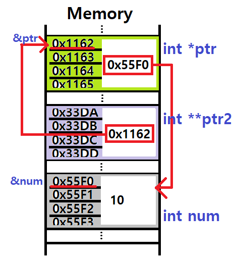
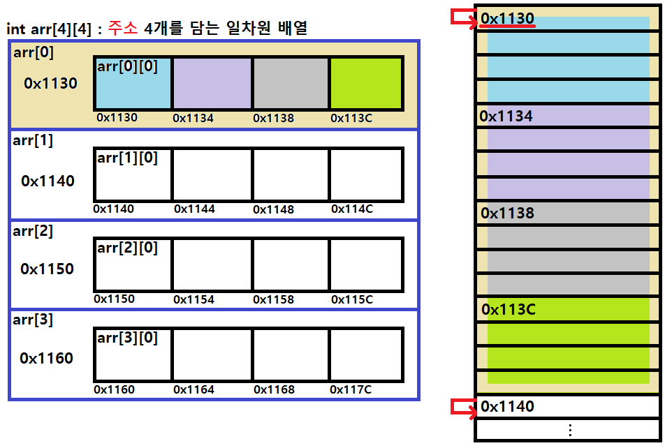

## Review

#### Quiz!

* 포인터와 배열 관련하여 주소 개념을 잘 이해하고 있는지 확인할 수 있는 문제

```c
#include <stdio.h>

int main(void) {
	int array[2][4]={
        {1, 2, 3, 4},
        {5, 6, 7, 8}
    };
    
	/*1*/ printf("%#p\n" , array );		// 0x0039FCE8
	/*2*/ printf("%#p\n" , array + 1 );	// ____________
	/*3*/ printf("%#p\n" , * array );	// ____________
	/*4*/ printf("%#p\n" , array[1] );	// ____________
    
	/*5*/ printf("%d\n" , array[0][0] + 3 );	// ____
    /*6*/ printf("%d\n" ,  *( array[0] + 2 ));	// ____
    /*7*/ printf("%d\n", *(*(array + 1) + 3 ));	// ____
	return 0;
}

   // 다차원 배열에서 * 라는 연산자, & 라는 연산자, [] 라는 접근 방법

    // * 가 붙으면 [] 하나가 붙는다! 라고 이해를 했었음.
    // & 가 붙으면 [] 하나가 없어진다.  *가 없어진다.
    // &, *, [] 이게 어떻게 유기적으로 다르게 표현 가능한지.

    array[2][4] 2차원 배열에서
    
    &array[0] == array
    &array[0][0] == *array
    &array[0] == array
    array == array
```


* 위 프로그램에서 1 의 출력 결과가 **0x0039FCE8** 이었다. 2부터 7까지의 출력결과는?


> 2. **0x0039FCE8** + 16byte == 0x0039 FC**F**8 
> 3. *array == array[0] == &array\[0][0] == 0x0039FC**E**8 
> 4. &array\[1][0] == 0x0039FC**F**8
>
> 5. array\[0][0]+3 == 4 
> 6. array\[0][2] == 3 
> 7. array\[1][3] == 8


* 이차원 포인터


* 메모리의 구체적인 주소




* 이차원 포인터의 사용

```c
#include <stdio.h>

void main() {
	int num = 10;
	int* ptr = &num;
	int** ptr2 = &ptr;

	printf("%d == %d == %d \n", num, *ptr, **ptr2);
	printf("%p == %p == %p \n", &num, ptr, *ptr2);
	printf("%p == %p \n", &ptr, ptr2);

	*ptr = 20;
	printf("%d\n", num);

	**ptr2 = 30;
	printf("%d\n", num);
}
```


* 이차원 포인터와 이차원 배열

```c
int twoArr[2][2] = { {1,2},	{3,4} };
int** ptrptr = twoArr; // == &twoArr == twoArr[0] == &twoArr[0] == &twoArr[0][0]

printf("twoArr \t\t= %p\n", twoArr);
printf("&twoArr \t= %p\n", &twoArr);
printf("twoArr[0] \t= %p\n", twoArr[0]);
printf("&twoArr[0] \t= %p\n", &twoAr[0]);
printf("&twoArr[0][0] \t= %p\n", &twoArr[0][0]);
```




* 


* 메모리적인 관점

  * 0x0039... 는 컴퓨터 메모리 어딘가의 '주소'

  ```c
  int value = 10;
  
  &value; // 0x0055.. 처럼 메모리 어딘가에 4byte 만큼 할당 된 것.
  value	// 그 주소에 해당하는 공간에 10이라는 값이 들어있는 것.
  ```

  


### 직접 구현할 수 있을까?

* strlen(char *s)  길이 구하는 함수

  ```
  for(i=0; s[i]!=NULL; i++)
  	return i
  ```


* mystrcpy()  복사 하는 함수

* mystrcat()  이어붙이는 함수

  

### 실습 해봅시다!

* strcmp()  // 구현되어 있는 공식 함수
* **int myStrCmp(char* from, char* to)**
  * 매개 변수 두 개 넘겨주기
  * from, to - char형 배열 이든, char형 포인터 상수든. "_____"
  * from, to 비교를 해서 동일한 문자열이면 1 아니면 0을
  * **대소문자 구별 안해!!**
    * Test string  ==  test String   이랑 같은거다!! 라고 인식.


```c
#include <stdio.h>
#include <ctype.h>

int myStrCmp(char* from, char* to) {
    int i;
    
    // i=0 ~ from의 길이(strlen(from)  또는 from[i] != NULL  또는  *from != NULL)까지 반복문 돌려서
    // from의 i번째와 to의 i번째가 같으면 넘어가고 다르면 false!!!
    // 반복문이 끝까지 잘 수행되면 true!!
    
}
	
void main() {
	char* from = "test string";
	char* to = "test string";
	
    if (myStrCmp(from, to)) {
    	print("same string\n");
    } else {
    	print("different string\n");
    }

}
```


### 문자?

입력했을 때 화면에 출력 되는것.

* **getchar**() : 버퍼 유 / 에코 있는 함수   입력 하고 엔터

* **getche**() : 버퍼 무 / 에코 있는 함수   입력만 하면 화면 출력

* **getch**() : 버퍼 무 / 에코 없고           입력만 하면 입력됨. 화면 출력 없음. -> 비밀번호 구현..


